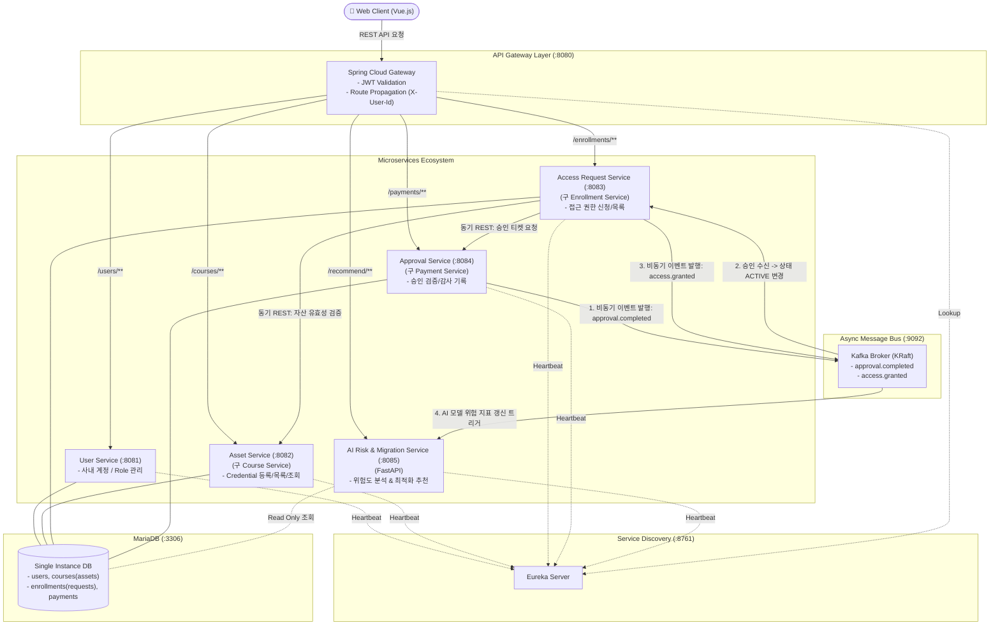

# 🛡️ [KeyNexus] 사내 프로젝트별 Credential 거버넌스 플랫폼
## Agile & MSA 기반 서비스 전환 및 스프린트 1·2 역할 분담/개발 설계서

---

## 1. 비즈니스 정의 및 이해관계자 Pain Point 분석

### 1-1. 배경 및 문제 정의 (Pain Points)
현대 기업의 소프트웨어 개발 환경에서는 수많은 프로젝트가 생성되고 종료되며, 그 과정에서 클라우드 키(AWS IAM, GCP Service Account), DB 접속 계정, 결제/외부 API Secret이 무분별하게 발급되고 방치됩니다.

```
[현재 상황의 악순환]
개발자 : "API Key 어디 있죠? 누구한테 요청해요?" ──▶ 슬랙/노션에 비밀번호 평문 공유 (보안 사고 위험)
PM/TL  : "프로젝트 끝났는데 어떤 키를 회수해야 하죠?" ──▶ 알 수 없어 방치 (불필요 과금 발생)
보안팀 : "누가 발급했고 언제 만료되는지 파악 불가" ──▶ 전사 감사(Audit) 시 증적 누락
기  업 : "퇴사자/프로젝트 종료 시 자산 추적 단절" ──▶ 기업의 디지털 지적 자산 유실
```

### 1-2. 우리 솔루션이 제공하는 핵심 가치 (Core Value)
1. **단일 창구 가시화 (Single Pane of Glass)**: 프로젝트를 열면 운영에 필요한 모든 Credential(Digital Asset)과 책임자(Owner)를 즉시 확인.
2. **5대 컨텍스트 연결**: 모든 자산에 `Project` / `Owner` / `Purpose` / `Consumer(사용 프로젝트/개발자)` / `Lifecycle(만료/회수)` 메타데이터 바인딩.
3. **영구적 기업 자산화**: 프로젝트 종료 시 개인에게 흩어져 있던 인증 정보를 기업 관리 자산으로 즉시 전환 및 회수.

---

## 2. 도메인 매핑표 (기존 MSA 템플릿 ➔ Credential 솔루션)

기존 온라인 강의 템플릿의 엔티티 및 비즈니스 로직을 **1:1로 치환**하여 백엔드 DB 스키마 수정 비용을 '0'으로 최소화합니다.

| 기존 템플릿 개념 | 기존 시스템 요소 | Credential 거버넌스 솔루션 매핑 | 비즈니스 및 UI 의미 |
| :--- | :--- | :--- | :--- |
| **강사 (Instructor)** | `Role: INSTRUCTOR` | **자산 관리자 / Tech Lead** | Credential을 생성·등록하고 승인 권한을 가진 테크 리드/보안 관리자 |
| **수강생 (Student)** | `Role: STUDENT` | **프로젝트 개발자 (Consumer)** | 프로젝트 개발을 위해 Credential 접근 권한을 요청하는 개발자 |
| **과목 (Course)** | `courses` 테이블 / Service | **디지털 자산 (Credential Asset)** | AWS IAM, DB 접속정보, 결제 API Key 등 등록된 디지털 자산 |
| **과목 카테고리** | `courses.category` | **자산 분류 (Asset Type)** | `BACKEND`(DB/서버), `CLOUD_IAM`, `DATABASE`, `SECURITY`(API Key/Token) |
| **수강료 (Price)** | `courses.price` | **자산 중요도/위험 비용 (Impact Tier)** | 침해 시 비즈니스 위험도 수준 (예: 100=Low, 300=Medium, 500=Critical) |
| **수강생 수 (EnrollmentCount)** | `courses.enrollment_count`| **활성 참조자 수 (Active Consumers)** | 현재 해당 Credential을 연동하여 사용 중인 프로젝트/개발자 수 |
| **수강신청 (Enrollment)** | `enrollments` 테이블 / Service | **접근 권한 요청 (Access Request)** | 개발자가 특정 자산에 대한 접근 및 사용 권한을 신청 (`PENDING` 상태) |
| **결제 (Payment)** | `payments` 테이블 / Service | **보안 검증 및 승인 (Security Grant)** | 관리자 승인 및 감사 티켓 발행 ➔ `COMPLETED` 시 접근 권한 활성화 |
| **수강 권한 활성화** | `enrollments.status = ACTIVE` | **Credential Check-out 활성화** | 승인 완료되어 개발자가 복호화된 Key/Secret 정보에 접근 가능 |
| **추천 서비스 (Recommend)**| `recommend-service` (FastAPI)| **AI 거버넌스 및 위험도 분석기** | 다중 의존성, 만료일, 중요도 기반 **위험도 분석 및 마이그레이션 우선순위 추천** |

---

## 3. 스프린트(Sprint) 분할 및 단계별 로드맵

Agile 방법론의 핵심은 **"작게 나눠서 빠르게 만들고 피드백을 반영해 점진적으로 확장하는 것"**입니다.  
이사할 때 당장 없으면 안 되는 '침대/냉장고(핵심 MVP)'부터 옮기고, '장식품/가구(확장 기능)'는 나중에 옮기듯 스프린트를 나눕니다.

```
┌─────────────────────────────────────────────────────────────────────────────────┐
│ [Sprint 1] 핵심 가치 검증 (MVP)                                                 │
│  "이 기능이 없으면 서비스로서 가치를 줄 수 없는가?"                                │
│  ▶ 계정 인증 (JWT) ➔ 자산 등록 ➔ 자산 목록/상세 조회 ➔ 접근 권한 신청 (PENDING)    │
│  ▶ 백엔드 3개 서비스(User, Asset, Request) + 프론트엔드 기본 UI 연결                │
└────────────────────────────────────────┬────────────────────────────────────────┘
                                         │ 피드백 수집 및 안정화
                                         ▼
┌─────────────────────────────────────────────────────────────────────────────────┐
│ [Sprint 2] 비즈니스 자동화 & AI 솔루션 확장                                     │
│  "있으면 업무 효율이 극대화되지만, 없어도 기본 동작은 가능한 기능"                 │
│  ▶ 비동기 Kafka 이벤트 기반 보안 승인 자동화 (Payment ➔ Request 상태 ACTIVE 전환) │
│  ▶ FastAPI 기반 AI 위험도 분석 & 마이그레이션 전략 제안 (Recommend Service 치환)  │
│  ▶ 실시간 승인 확인 및 AI 거버넌스 리포트 대시보드 UI 연동                        │
└─────────────────────────────────────────────────────────────────────────────────┘
```

### 3-1. 스프린트 1 (Sprint 1) : 핵심 MVP (Minimum Viable Product)
* **목표**: 개발자와 관리자가 로그인하여 사내 자산을 확인하고, 자산을 등록하며, 접근 권한을 요청하는 End-to-End 기본 흐름 완성.
* **우선순위 선정 이유**:
  - 사용자에게 Credential 거버넌스 솔루션으로서의 최소한의 가치를 주기 위해서는 자산의 가시화(목록/상세)와 요청 프로세스가 필수적입니다.
  - 이 단계에서는 복잡한 비동기 결제/승인 로직이나 AI 분석 없이도 동기식 REST API만으로 핵심 흐름이 검증됩니다.
* **세부 구현 범위**:
  1. **인증/계정 (`User Service`)**: 관리자(INSTRUCTOR)와 개발자(STUDENT) 로그인 및 JWT 토큰 발급.
  2. **자산 카탈로그 (`Course Service ➔ Asset Service`)**:
     - 관리자의 신규 Credential(API Key, Cloud IAM 등) 등록 (`POST /api/courses`)
     - 개발자의 전체/카테고리별 자산 목록 탐색 및 상세 조회 (`GET /api/courses`, `GET /api/courses/{id}`)
  3. **접근 권한 신청 (`Enrollment Service ➔ Access Request Service`)**:
     - 개발자의 자산 사용 신청 (`POST /api/enrollments` ➔ `PENDING` 상태 생성)
     - 내 자산 신청/보유 현황 조회 (`GET /api/enrollments/my`)
  4. **프론트엔드 UI (`Vue Frontend`)**:
     - 로그인 화면, 자산 카탈로그 뷰, 자산 등록 모달, 내 신청함 뷰 연동.
* **Sprint 1 완료 정의 (Definition of Done)**:
  - 브라우저에서 개발자 계정으로 로그인 후 자산 카탈로그에서 원하는 Credential을 찾아 [신청] 버튼을 눌렀을 때, DB `enrollments` 테이블에 `PENDING` 상태로 정상 저장되고 화면에 신청 완료가 표시됨.

---

### 3-2. 스프린트 2 (Sprint 2) : 비동기 이벤트 연동 & AI 솔루션 확장
* **목표**: 비동기 Kafka 메시지 브로커를 통한 승인 프로세스 자동화 및 FastAPI 기반 AI 위험도 분석 엔진 탑재.
* **우선순위 선정 이유**:
  - Sprint 1에서 검증된 핵심 서비스(User, Asset, Request)의 코드를 **전혀 수정하지 않고**, 신규 서비스(`Payment/Approval`, `Recommend/AI`)를 독립적으로 연결하여 MSA의 "독립 배포 및 확장성"을 실증합니다.
* **세부 구현 범위**:
  1. **비동기 보안 승인 (`Payment Service ➔ Approval Service`)**:
     - 관리자의 승인 처리 호출 (`POST /api/payments/internal/request`)
     - Kafka 이벤트 `payment.completed` 발행 ➔ `Enrollment Service`가 수신하여 접근 상태를 `ACTIVE`로 자동 전환.
     - `enrollment.completed` 이벤트 발행 ➔ AI 서비스 갱신 트리거.
  2. **AI 위험도 분석 & 마이그레이션 추천 (`Recommend Service (FastAPI)`)**:
     - 자산별 참조 프로젝트 수(`enrollment_count`), 중요도(`price`), 수명(Lifecycle)을 결합한 위험 지수 산출.
     - 다중 의존 고위험 자산에 대한 마이그레이션 우선순위 추천 API 제공 (`GET /api/recommend/{userId}`).
  3. **프론트엔드 확장 (`Vue Frontend`)**:
     - 승인 완료(`ACTIVE`) 시 Secret 마스킹 해제 및 Key Check-out UI 노출.
     - AI 분석 기반 **'⚠️ 고위험 자산 점검 및 마이그레이션 권고 대시보드'** 패널 추가.
* **Sprint 2 완료 정의 (Definition of Done)**:
  - 승인 트리거 발생 시 Kafka 메시지를 통해 상태가 `ACTIVE`로 변경되는 비동기 라이프사이클이 입증되고, AI 추천 API를 통해 도출된 위험도 분석 리포트가 대시보드에 정상 렌더링됨.

---

## 4. MSA 아키텍처 및 서비스 간 인터페이스 설계

### 4-1. 서비스 아키텍처 다이어그램



### 4-2. 핵심 API 엔드포인트 명세서 (프론트-백엔드 Contract)

| 서비스 도메인 | Method | 엔드포인트 (Gateway 경로) | 헤더 / 파라미터 | 기능 설명 | 스프린트 |
| :--- | :---: | :--- | :--- | :--- | :---: |
| **Auth / User** | `POST` | `/api/users/login` | Body: `{email, password}` | 로그인 및 JWT 토큰 발급 | Sprint 1 |
| **Auth / User** | `POST` | `/api/users/register`| Body: `{name, email, password, role}` | 신규 담당자/개발자 등록 | Sprint 1 |
| **Asset (Course)** | `GET` | `/api/courses` | `Authorization: Bearer <토큰>` | 전체 Credential 자산 목록 조회 | Sprint 1 |
| **Asset (Course)** | `POST` | `/api/courses` | `X-User-Id` (관리자 권한 필요) | 신규 Credential 자산 등록 | Sprint 1 |
| **Asset (Course)** | `GET` | `/api/courses/{id}` | `Authorization: Bearer <토큰>` | Credential 상세 및 메타데이터 | Sprint 1 |
| **Access (Enroll)** | `POST` | `/api/enrollments` | Body: `{"courseId": 1}` | Credential 접근 권한 요청 | Sprint 1 |
| **Access (Enroll)** | `GET` | `/api/enrollments/my`| `Authorization: Bearer <토큰>` | 내가 요청/보유한 자산 권한 목록 | Sprint 1 |
| **Approval (Pay)** | `POST` | `/api/payments/internal/request`| Body: `{userId, courseId, amount}` | 보안 승인 처리 및 Kafka 이벤트 | Sprint 2 |
| **AI Risk Advisor** | `GET` | `/api/recommend/{userId}`| Path: `{userId}` | 위험도 분석 및 우선순위 추천 반환 | Sprint 2 |

---

## 5. 팀원별 Task 분담 및 WBS (충돌 제로 병렬 전략)

### 5-1. 백엔드 팀 Task
* **Sprint 1**:
  - `docker compose up`으로 인프라 및 DB 초기화 검증.
  - `courses` 테이블에 사내 Credential 초기 데모 데이터(AWS IAM, DB Secret 등) INSERT.
  - Swagger UI에서 로그인 ➔ 자산 등록 ➔ 접근 신청 End-to-End 동작 검증 및 cURL 명세 공유.
* **Sprint 2**:
  - Kafka 브로커를 통한 `payment.completed` ➔ `enrollment ACTIVE` 비동기 상태 전환 파이프라인 검증.
  - `recommend-service` (FastAPI)의 비즈니스 로직을 자산 위험도 분석 수식으로 커스텀.

### 5-2. 프론트엔드 팀 Task
* **Sprint 1**:
  - 전역 브랜딩 및 텍스트를 `LearnNexus` ➔ `KeyNexus (Credential 거버넌스)`로 치환.
  - `CourseListView.vue`를 자산 카탈로그 카드로, `CourseCreateView.vue`를 자산 등록 폼으로 개편.
  - `sessionStorage` 기반 토큰 인터셉터 연결 및 권한 신청 연동.
* **Sprint 2**:
  - 비동기 승인 완료(`ACTIVE`) 시 Secret 복호화/노출 인터랙션 구현.
  - `GET /api/recommend/{userId}` 연동을 통한 AI 위험도 분석 대시보드 위젯 구현.

---

## 6. Sprint 2 AI 솔루션 확장 시나리오 제안 (3대 전략)

1. **방향 A (★ 강력 권장) : 서비스 중요도 및 의존성 기반 [위험도 분석 & 마이그레이션 AI]**
   - 수식: $\text{Risk Score} = \text{Price (중요도)} \times \text{EnrollmentCount (의존 프로젝트 수)}$
   - 여러 시스템에서 공유 중인 고위험 Credential을 감지하여 Vault 마이그레이션 우선순위 권고.
2. **방향 B : 접근 로그 기반 [비인가 이상 징후 탐지 AI (Anomaly Detection)]**
   - 평소와 다른 시간대나 미등록 클라이언트의 비정상적 Secret 접근 시도 격리 및 경보.
3. **방향 C : LLM 기반 [사내 보안 정책 준수 및 Key Check-out Copilot]**
   - 개발자의 자연어 요청에 따라 적정 권한 검증 및 자산 승인 티켓 자동 작성.

---

## 7. 조별 발표 기획서 표준 흐름 (6단계)

1. **[Why] 이해관계자 Pain Point**: 개발자/PM/보안팀/기업의 Credential 관리 부재 고통
2. **[What] AI 솔루션 정의**: KeyNexus의 핵심 가치와 AI 거버넌스 역할
3. **[How - Plan] 스프린트 구분**: Sprint 1(핵심 MVP) vs Sprint 2(비동기 & AI) 우선순위 근거
4. **[Architecture] 아키텍처 구성도**: Eureka, Gateway, 5개 서비스, Kafka, DB 흐름도
5. **[Interface] API 명세**: Swagger 기반 핵심 엔드포인트 규격
6. **[Result] 실제 동작 화면 스냅샷**: 자산 등록 ➔ 권한 신청 ➔ 승인 ➔ AI 위험도 대시보드 화면
