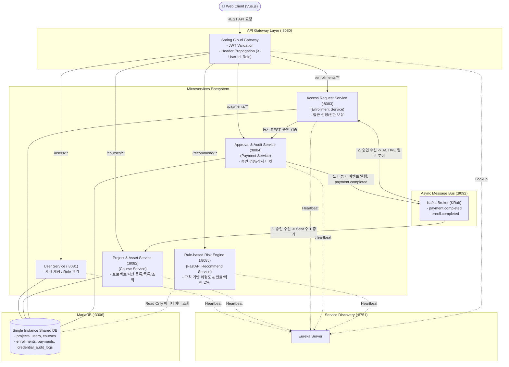

# 🛡️ [KeyNexus] 사내 프로젝트별 Credential 거버넌스 플랫폼
## Agile & MSA 기반 서비스 전환 및 스프린트 1·2 역할 분담/개발 설계서 (v2.1.0)

---

## 1. 비즈니스 정의 및 이해관계자 Pain Point 분석

### 1-1. 배경 및 문제 정의 (Pain Points)
현대 기업의 소프트웨어 개발 환경에서는 수많은 프로젝트가 생성되고 종료되며, 그 과정에서 클라우드 키(AWS IAM, GCP Service Account), DB 접속 계정, 결제/외부 API Secret이 무분별하게 발급되고 방치됩니다.

```text
[현재 상황의 악순환]
개발자 : "API Key 어디 있죠? 누구한테 요청해요?" ──▶ 슬랙/노션에 비밀번호 평문 공유 (보안 사고 위험)
PM/TL  : "프로젝트 끝났는데 어떤 키를 회수해야 하죠?" ──▶ 알 수 없어 방치 (불필요 과금 발생)
보안팀 : "누가 발급했고 언제 만료되는지 파악 불가" ──▶ 전사 감사(Audit) 시 증적 누락
기  업 : "퇴사자/프로젝트 종료 시 자산 추적 단절" ──▶ 기업의 디지털 지적 자산 유실
```

### 1-2. 우리 솔루션이 제공하는 핵심 가치 (Core Value)
1. **프로젝트 단위 가시성 (Project-Centric Visibility)**: 최상위 프로젝트(`projects`)를 열면 해당 프로젝트 운영에 필요한 모든 Credential과 책임자(Owner)를 즉시 확인.
2. **최소 권한 원칙 (Least Privilege)**: 모든 자산 접근은 '신청 ➔ 승인' 단계를 거치며, 승인 완료 시 자산에 안전하게 접근 권한 부여 및 관리자의 명시적 회수 기능 제공.
3. **규칙 기반 위험도 및 만료 알림 (Rule-based Risk & Expiration Governance)**: 객관적인 규칙 기반으로 API Key 만료/회전 임박 및 구독 Plan 갱신 주기를 감지하고 알림 리포트 제공.

---

## 2. 도메인 매핑표 (기존 MSA 템플릿 ➔ Credential 솔루션)

| 기존 템플릿 개념 | 기존 시스템 요소 | Credential 거버넌스 솔루션 매핑 | 비즈니스 및 UI 의미 |
| :--- | :--- | :--- | :--- |
| **신규 (Root Boundary)** | `projects` 테이블 / Service | **사내 프로젝트 (Project Boundary)** | 자산 및 거버넌스 격리의 최상위 영역 (프로젝트 단위 자산 관리) |
| **강사 (Instructor)** | `Role: INSTRUCTOR` | **자산 관리자 / Tech Lead** | Credential을 등록하고 승인 권한을 가진 테크 리드/보안 관리자 |
| **수강생 (Student)** | `Role: STUDENT` | **프로젝트 개발자 (Consumer)** | 프로젝트 개발을 위해 Credential 접근 권한을 요청하는 개발자 |
| **과목 (Course)** | `courses` 테이블 / Service | **디지털 자산 (Credential Asset)** | AWS IAM, DB 접속정보, API Key 및 SaaS 구독 Plan |
| **과목 카테고리** | `courses.category` | **자산 분류 (Asset Type)** | `API_KEY`, `SUBSCRIPTION_PLAN`, `DB_CREDENTIAL` |
| **수강생 수 (EnrollmentCount)** | `courses.enrollment_count`| **활성 참조자 수 (Active Consumers)** | 현재 해당 Credential을 연동하여 사용 중인 개발자/프로젝트 수 |
| **수강신청 (Enrollment)** | `enrollments` 테이블 / Service | **접근 권한 신청 (Access Request)** | 개발자가 자산 접근 권한을 신청 (`PENDING` ➔ `ACTIVE` 권한 활성화) |
| **결제 (Payment)** | `payments` 테이블 / Service | **보안 검증 및 승인 (Security Grant)** | 관리자 승인 및 감사 티켓 UUID 발행 ➔ `COMPLETED` 시 접근권 활성화 |
| **추천 서비스 (Recommend)**| `recommend-service` (FastAPI)| **규칙 기반 위험도 및 만료 알림 엔진** | API Key 만료/회전 주기 및 구독 갱신 위험 점수(0~100) 계산 및 알림 |

---

## 3. 스프린트(Sprint) 분할 및 단계별 로드맵

```text
┌─────────────────────────────────────────────────────────────────────────────────┐
│ [Sprint 1] 핵심 가치 검증 (MVP)                                                 │
│  "이 기능이 없으면 서비스로서 가치를 줄 수 없는가?"                                │
│  ▶ 계정 인증 ➔ 프로젝트 생성 ➔ 자산 등록 ➔ 자산 목록/상세 ➔ 접근 권한 신청 (PENDING)│
│  ▶ 백엔드 3개 서비스(User, Project/Asset, Request) + 프론트엔드 기본 UI 연결        │
└────────────────────────────────────────┬────────────────────────────────────────┘
                                         │ 피드백 수집 및 안정화
                                         ▼
┌─────────────────────────────────────────────────────────────────────────────────┐
│ [Sprint 2] 비동기 이벤트 연동 & 규칙 기반 거버넌스 알림 확장                     │
│  "있으면 업무 효율이 극대화되지만, 없어도 기본 동작은 가능한 기능"                 │
│  ▶ 비동기 Kafka 이벤트 기반 보안 승인 (Payment ➔ Request ACTIVE 권한 부여)        │
│  ▶ FastAPI 기반 규칙 기반 위험도 점수 계산 & 만료/회전 알림 대시보드 위젯        │
│  ▶ Secret 평문 마스킹 해제 및 감사 로그(credential_audit_logs) 적재               │
└─────────────────────────────────────────────────────────────────────────────────┘
```

### 3-1. 스프린트 1 (Sprint 1) : 핵심 MVP
* **목표**: 프로젝트 생성 ➔ 자산 등록 ➔ 접근 권한 신청 E2E 기본 흐름 완성 및 DB 암호화 적용.
* **세부 구현 범위**:
  1. **인증/계정 (`User Service`)**: ADMIN, SECURITY, LEADER, MEMBER 역할 로그인 및 JWT 발급.
  2. **프로젝트 & 자산 카탈로그 (`Course Service`)**: 프로젝트 생성 (`POST /api/courses/projects`), 자산 등록 (`POST /api/courses`), 자산 목록/상세 조회 (`GET /api/courses`).
  3. **접근 권한 신청 (`Enrollment Service`)**: 권한 신청 (`POST /api/enrollments`), 내 신청 현황 조회 (`GET /api/enrollments/my`).
  4. **프론트엔드 UI**: 프로젝트/자산 카탈로그, 자산 등록 모달, 내 신청함 뷰 연동.

### 3-2. 스프린트 2 (Sprint 2) : 비동기 승인 연동 & 규칙 기반 거버넌스 확장
* **목표**: Kafka 비동기 승인 파이프라인 완성 및 FastAPI 기반 규칙 기반 위험도/만료 알림 엔진 연동.
* **세부 구현 범위**:
  1. **비동기 보안 승인 (`Payment Service`)**: 승인/거절 처리 (`POST /api/payments/{id}/approve`), Kafka 이벤트 `payment.completed` 발행, 감사 티켓 UUID 생성.
  2. **권한 활성화 & 회수 (`Enrollment Service`)**: Kafka 이벤트 수신 시 `ACTIVE` 상태 전환, Secret 평문 조회 시 `last_accessed_at` 비동기 갱신, 권한 회수 시 `CANCELLED` 처리.
  3. **규칙 기반 위험도 엔진 (`Recommend Service - FastAPI`)**: 만료 임박, 회전 주기 경과, 활성 사용자 수 등 수식으로 0~100점 점수 및 `CRITICAL/HIGH` 등급 계산, 알림 리포트 반환 (`POST /api/recommend/projects/{projectId}/analyze`).
  4. **감사 로그 및 UI 연동**: `credential_audit_logs` 적재, 프론트엔드 마스킹 해제 뷰어 및 위험도/만료 알림 대시보드 위젯 구현.

---

## 4. MSA 아키텍처 및 서비스 간 인터페이스 설계

### 4-1. 서비스 아키텍처 다이어그램



### 4-2. 핵심 API 엔드포인트 명세서

| 서비스 도메인 | Method | 엔드포인트 (Gateway 경로) | 헤더 / 파라미터 | 기능 설명 | 스프린트 |
| :--- | :---: | :--- | :--- | :--- | :---: |
| **Auth / User** | `POST` | `/api/users/login` | Body: `{email, password}` | 로그인 및 JWT 토큰 발급 | Sprint 1 |
| **Project** | `POST` | `/api/courses/projects` | `X-User-Id` (관리자/리더) | 신규 사내 프로젝트 생성 | Sprint 1 |
| **Project** | `GET` | `/api/courses/projects` | `Authorization: Bearer <토큰>` | 프로젝트 목록 조회 | Sprint 1 |
| **Asset (Course)** | `GET` | `/api/courses` | Query: `projectId=1&category=API_KEY` | 프로젝트별 자산 목록 조회 | Sprint 1 |
| **Asset (Course)** | `POST` | `/api/courses` | `X-User-Id` (관리자/리더) | 신규 Credential 자산 등록 | Sprint 1 |
| **Access (Enroll)** | `POST` | `/api/enrollments` | Body: `{"courseId": 1, "reason": "..."}` | Credential 접근 권한 신청 | Sprint 1 |
| **Access (Enroll)** | `GET` | `/api/enrollments/my`| `Authorization: Bearer <토큰>` | 내 자산 권한 및 신청 목록 | Sprint 1 |
| **Access (Enroll)** | `GET` | `/api/enrollments/{id}/secret` | `Authorization: Bearer <토큰>` | Secret 평문 조회 (last_accessed_at) | Sprint 2 |
| **Approval (Pay)** | `POST` | `/api/payments/{id}/approve`| Body: `{decisionReason}` | 보안 승인 처리 및 Kafka 이벤트 | Sprint 2 |
| **Rule Risk Engine**| `POST` | `/api/recommend/projects/{projectId}/analyze` | Path: `{projectId}` | 규칙 기반 위험도 및 만료 알림 반환 | Sprint 2 |

---

## 5. 팀원별 Task 분담 및 WBS

### 5-1. 백엔드 팀 Task
* **Sprint 1**:
  - `projects`, `courses`, `users`, `enrollments`, `payments`, `credential_audit_logs` DDL 및 JPA 암호화 작성.
  - 프로젝트 및 자산 CRUD REST API 구현.
* **Sprint 2**:
  - Kafka 브로커를 통한 `payment.completed` ➔ `enrollment ACTIVE` 비동기 상태 전환 구현.
  - FastAPI 기반 `recommend-service` 규칙 기반 Risk Engine 구현.

### 5-2. 프론트엔드 팀 Task
* **Sprint 1**:
  - 프로젝트 및 자산 카탈로그 뷰, 프로젝트/자산 등록 모달 구현.
* **Sprint 2**:
  - Secret 평문 마스킹 해제 뷰어 구현.
  - 프로젝트 위험도 및 만료 알림 대시보드 위젯 구현.
