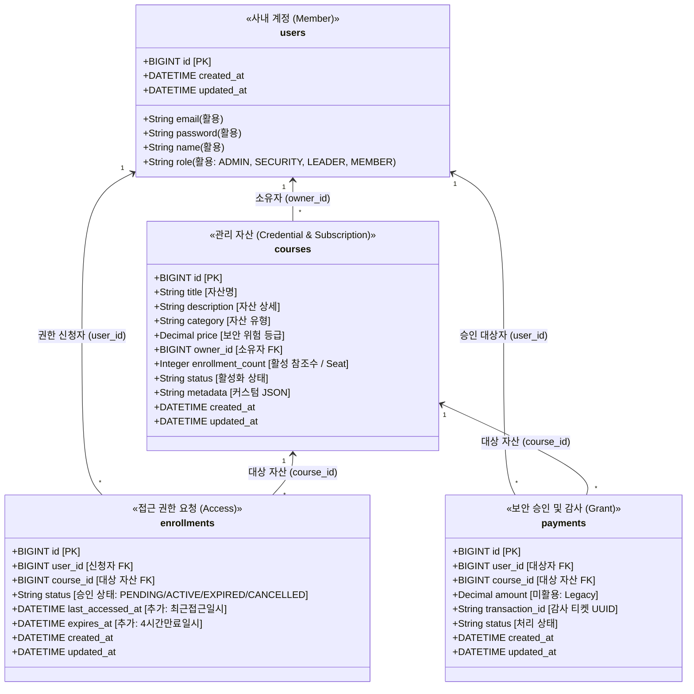
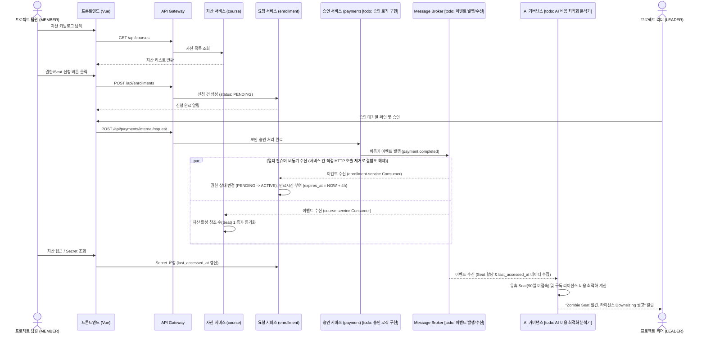

# 📋 \[KeyNexus] 시스템 요구사항 정의서 (SRS)

## Software Requirements Specification: Enterprise Credential & Digital Asset Governance Platform

> **문서 버전**: v1.0.0\
> **작성 기준일**: 2026-08-26\
> **문서 책임자**: PM / 기획 파트\
> **대상 독자**: 백엔드 엔지니어, 프론트엔드 엔지니어
> \
> **문서 목적**: 본 문서는 KeyNexus 플랫폼 개발에 필요한 기능적/비기능적 요구사항, 데이터 모델, API 인터페이스 규격, UI/UX 흐름 및 트러블슈팅 기준을 정의한 **개발의 단일 진실 공급원(Single Source of Truth)**입니다.

***

# 📑 목차 (Table of Contents)

1. [시스템 개요 및 프로젝트 목표](#1-시스템-개요-및-프로젝트-목표)
2. [용어 정의 및 도메인 데이터 사전](#2-용어-정의-및-도메인-데이터-사전)
3. [시스템 아키텍처 및 네트워크 규격](#3-시스템-아키텍처-및-네트워크-규격)
4. [공통 인증 및 인가 규격 (Security Baseline)](#4-공통-인증-및-인가-규격-security-baseline)
5. [기능별 상세 요구사항 (Functional Requirements)](#5-기능별-상세-요구사항-functional-requirements)

   * 5.1 \[FR-01] 계정 및 사용자 권한 관리 (`user-service`)

   * 5.2 \[FR-02] 디지털 자산(Credential) 카탈로그 관리 (`course-service`)

   * 5.3 \[FR-03] 접근 권한 신청 및 라이프사이클 관리 (`enrollment-service`)

   * 5.4 \[FR-04] 보안 검증 및 비동기 승인 발급 (`payment-service`)

   * 5.5 \[FR-05] AI 기반 구독 비용 최적화 및 거버넌스 (`recommend-service`)
6. [비기능 요구사항 (Non-Functional Requirements)](#6-비기능-요구사항-non-functional-requirements)
7. [데이터베이스 설계 및 스키마 명세](#7-데이터베이스-설계-및-스키마-명세)
8. [API 인터페이스 상세 규격서 (REST Contract)](#8-api-인터페이스-상세-규격서-rest-contract)
9. [이벤트 메시지 규격서 (Kafka Event Contract)](#9-이벤트-메시지-규격서-kafka-event-contract)
10. [화면 정의 및 프론트엔드 컴포넌트 설계](#10-화면-정의-및-프론트엔드-컴포넌트-설계)
11. [스프린트별 개발 범위 (Sprint Scope & DoD)](#11-스프린트별-개발-범위-sprint-scope--dod)
12. [개발자 FAQ 및 트러블슈팅 가이드](#12-개발자-faq-및-트러블슈팅-가이드)

***

# 1. 시스템 개요 및 프로젝트 목표

### 1.1 시스템 개요

**KeyNexus**는 기업 내 분산되어 관리되던 각종 클라우드 IAM Key, 데이터베이스 계정, 외부 결제/통신 API Secret 등의 디지털 인증 자산(Credential)을 프로젝트 단위로 가시화하고, 권한 요청-승인-만료-회수의 전 과정을 체계적으로 통제하는 **사내 Credential 거버넌스 솔루션**입니다.

### 1.2 핵심 프로젝트 목표

1. **가시성 확보 (Visibility)**: 사내 프로젝트에 연결된 모든 Credential의 소유자, 용도, 접근 권한자를 한 화면에서 조회.
2. **최소 권한 원칙 (Least Privilege)**: 모든 자산 접근은 '신청 ➔ 승인' 단계를 거치며, 미인가 사용자의 평문 Key 조회를 차단.
3. **지능형 비용 최적화 (AI Governance)**: AI가 유휴/장기 미회수 관리 자산(Zombie Seat)을 탐지하여 회수를 권고하고, 불필요한 구독 플랜의 다운사이징(Downsizing)을 추천하여 실질적인 라이선스 비용 절감 달성.
4. **Agile & MSA 실증**: 기존 5개 마이크로서비스 및 인프라 구조의 수정을 최소화하고, 도메인 매핑을 통해 즉시 가동 가능한 엔터프라이즈 플랫폼 구현.

***

# 2. 용어 정의 및 도메인 데이터 사전

### 2.1 핵심 비즈니스 용어 사전 (Glossary)

팀원 및 고객사 간 명확한 소통을 위해 본 프로젝트에서 다루는 핵심 도메인 용어를 정의합니다.

* **관리 자산 (Managed Asset)**: 플랫폼에서 관리하는 모든 개체의 최상위 개념으로, '디지털 자산(Credential Asset)'과 '구독 플랜(Subscription Plan)'을 포괄합니다. 문서 내에서 단순 '자산'으로 표기된 경우 보통 이 '관리 자산'을 의미합니다.

* **디지털 자산 (Credential Asset)**: 사내/외 시스템, 데이터베이스, 클라우드 인프라 등에 접근하기 위해 사용되는 접근 권한 키(API Key, Secret, DB Connection String 등)를 의미합니다.

* **구독 플랜 (Subscription Plan)**: Notion, Figma, Slack 등 기업에서 부서 단위로 유료 결제하여 사용 중인 B2B SaaS 라이선스 묶음을 의미합니다.

* **시트 (Seat)**: 디지털 자산을 사용 중인 프로젝트의 수, 혹은 SaaS 구독 플랜을 점유하고 있는 개별 활성 사용자의 수를 의미합니다. 기존 레거시 시스템의 '수강생 수(`enrollment_count`)'와 완벽히 동일한 개념으로 매핑됩니다.

* **좀비 시트 (Zombie Seat)**: 할당은 되어 있으나 장기간(예: 90일 이상) 실제 접속이나 사용 이력이 없어 불필요한 라이선스 비용 낭비를 유발하는 유휴(Inactive) 권한입니다.

### 2.2 물리 스키마 - 도메인 용어 매핑 다이어그램

아래 클래스 다이어그램은 물리적인 테이블명(소문자)과 KeyNexus 플랫폼에서 쓰이는 비즈니스 도메인 용어(`<< >>` 및 괄호 표기)를 시각적으로 매핑한 구조입니다.



### 2.3 도메인 용어 코드 레벨 동기화

* 목적: 개발 과정에서 기존 템플릿의 물리 명칭(`Course`)과 도메인 용어(`디지털 자산`) 간의 혼란 방지

1. **API 스펙(Swagger)에 도메인 용어 강제 노출**

   * 백엔드 DTO(Data Transfer Object) 정의 시, `@Schema` 어노테이션의 `description` 속성 최상단에 **\[도메인 용어]를 대괄호로 기재**하여 Swagger UI에 강제 노출합니다.

   * *예시:* `@Schema(description = "[보안 위험 등급] 기존 price 필드를 재사용하여 100~500 범위의 중요도로 표기")`
2. **코드 내 커스텀 어노테이션(`@DomainTerm`) 도입**

   * 백엔드 엔티티 클래스 및 필드 상단에 `@DomainTerm("자산명")`과 같은 주석용 커스텀 어노테이션을 부착하여, IDE에서 커서를 올렸을 때 비즈니스 의미가 툴팁으로 바로 보이도록 구성합니다.

### 2.4 핵심 유저 시나리오 전체 흐름 (Sequence Diagram)

다음은 시스템 내에서 일반 개발자(MEMBER)가 자산 권한을 요청하고, 리더(LEADER)가 승인하며, AI 거버넌스가 동작하는 전체 흐름입니다.



***

# 3. 시스템 아키텍처 및 네트워크 규격

### 3.1 네트워크 토폴로지 및 포트 할당

```
                             [Client Browser]
                                     │ (HTTP / JSON)
                                     ▼
                   ┌───────────────────────────────────┐
                   │    Spring Cloud Gateway (:8080)   │
                   └─────────────────┬─────────────────┘
                                     │
         ┌───────────────┬───────────┼───────────────┬───────────────┐
         ▼               ▼           ▼               ▼               ▼
┌─────────────────┐┌──────────┐┌───────────┐┌─────────────────┐┌─────────────┐
│  user-service   ││  course  ││enrollment ││ payment-service ││ recommend-  │
│     (:8081)     ││ (:8082)  ││  (:8083)  ││     (:8084)     ││  service    │
│   (사내 계정)   ││(자산관리)││(권한신청) ││   (보안 승인)   ││   (:8085)   │
└────────┬────────┘└────┬─────┘└─────┬─────┘└────────┬────────┘└──────┬──────┘
         │              │            │               │                │
         └──────────────┼────────────┴───────────────┴────────────────┘
                        ▼
       ┌─────────────────────────────────┐      ┌─────────────────────────────┐
       │   MariaDB 11.2 (:3306) (DB)     │      │   Kafka Broker (:9092)      │
       │   - Single Instance Shared      │      │   - Topic: payment.completed│
       │   - [todo: DB 컬럼 레벨 암호화] │      │   - Topic: enroll.completed │
       └─────────────────────────────────┘      └─────────────────────────────┘
                                                      │
                                                [todo: Github Actions 자정 동기화 CI/CD]
```

* **서비스 탐색**: `eureka-server` (포트: `8761`)

* **인증 인프라**: `auth-server` (포트: `9000`)

* **단일 진입점**: `api-gateway` (포트: `8080`) — **프론트엔드는 오직 8080 포트만 호출**

***

# 4. 공통 인증 및 인가 규격 (Security Baseline)

### 4.1 인증 토큰 규격

* **방식**: OAuth2 / OpenID Connect 기반 JWT (JSON Web Token)

* **발급처**: `auth-server` (포트 `9000`) ➔ `POST /api/users/login` 응답으로 전달.

* **전송 규칙**: 프론트엔드는 모든 보호된 API 호출 시 헤더에 `Authorization: Bearer <토큰>` 첨부.

### 4.2 Gateway 헤더 전파 (Header Propagation)

API Gateway는 JWT 서명을 검증한 후, 복호화된 사용자 메타데이터를 하위 마이크로서비스로 HTTP 헤더를 통해 주입합니다.

| 주입 헤더명             | 내용                  | 예시 값                              | 하위 서비스 사용처             |
| :----------------- | :------------------ | :-------------------------------- | :--------------------- |
| **`X-User-Id`**    | 사용자 고유 식별 번호 (Long) | `1`                               | 자산 등록자 식별, 내 신청 목록 필터링 |
| **`X-User-Email`** | 사용자 이메일 계정          | `developer@company.com`           | 감사 로그 기록               |
| **`X-User-Role`**  | 사용자 권한 그룹           | `ROLE_MEMBER`, `ROLE_LEADER` | 인가(Authorization) 제어   |

***

# 5. 기능별 상세 요구사항 (Functional Requirements)

> **\[기능 구현 라벨 분류 기준]**
>
> * **\[완료]**: 기존 템플릿(강의 플랫폼)에 이미 구현되어 있어 즉시 사용 가능한 기능
>
> * **\[수정]**: 기존 기능에서 도메인(DB 구조, DTO, 텍스트) 변경 등 비교적 간단한 수정이 필요한 기능. (수정 방법 명시)
>
> * **\[work]**: 기존에 없거나 수정 범위를 넘어선 큰 단위의 작업이 필요한 신규 기능. (사용 기술 및 구현 방법 명시)

## 5.1 \[FR-01] 계정 및 사용자 권한 관리 (`user-service`)

* **[수정] FR-01-01 [회원가입]**
  * **요구사항**: 사내 직원은 이메일, 비밀번호, 이름, 역할을 입력하여 계정을 생성할 수 있다.
  * **구현 방안**: 기존 `ROLE` ENUM(`MEMBER`, `LEADER`)의 흔적을 지우고, 기획에 맞춰 `ADMIN, SECURITY, LEADER, MEMBER` 체계로 변경하여 스프링 시큐리티 인가(Authorization) 설정에 반영합니다.

* **[완료] FR-01-02 [로그인 및 토큰 발급]**
  * **요구사항**: 이메일과 비밀번호로 로그인 시 JWT Access Token을 발급받는다.

* **[완료] FR-01-03 [내 정보 조회]**
  * **요구사항**: 로그인된 사용자는 JWT 토큰을 기반으로 본인의 계정 정보 및 역할을 조회할 수 있다.

## 5.2 \[FR-02] 디지털 자산(Credential) 카탈로그 관리 (`course-service`)

* **[수정] FR-02-01 [자산 등록]**
  * **요구사항**: 리더 및 관리자(`ROLE_LEADER`, `ROLE_ADMIN`) 권한을 가진 사용자만 신규 관리 자산을 등록할 수 있다.
  * **구현 방안**: `category` Enum에 `SUBSCRIPTION_PLAN`을 추가하고 `metadata` JSON 필드를 처리하도록 DTO와 Entity를 수정합니다. 또한 DB 레벨의 Secret 필드에 JPA `@ColumnTransformer`를 적용하여 양방향 암호화 처리를 반영합니다.

* **[완료] FR-02-02 [자산 목록 조회]**
  * **요구사항**: 모든 인증된 사용자는 등록된 관리 자산 전체 목록을 조회할 수 있다.

* **[완료] FR-02-03 [자산 상세 조회]**
  * **요구사항**: 자산 ID를 통해 해당 관리 자산의 메타데이터 및 소유자 정보를 단건 조회할 수 있다.

* **[완료] FR-02-04 [카테고리별 필터링]**
  * **요구사항**: 자산 유형(`category`)별로 관리 자산 목록을 필터링 조회할 수 있다.

* **[수정] FR-02-05 [활성 참조수 비동기 자동 갱신]**
  * **요구사항**: 보안 승인이 완료되어 Kafka `payment.completed` 이벤트가 발생하면, `course-service`에서 독립된 Kafka Consumer로 이를 수신하여 해당 자산의 `enrollment_count`를 1 증가시킨다.
  * **구현 방안**: 기존 동기 HTTP 수강생 증가 방식을 폐기하고, Spring Kafka `@KafkaListener` 기반 독립 컨슈머로 전환하여 `enrollment-service`와의 결합도를 제거하고 데이터 정합성을 보장합니다.

## 5.3 \[FR-03] 접근 권한 신청 및 라이프사이클 관리 (`enrollment-service`)

* **[수정] FR-03-01 [접근 권한 신청]**
  * **요구사항**: 프로젝트 팀원(`ROLE_MEMBER`) 등 일반 사용자는 특정 자산 ID를 지정하여 사용 권한을 신청한다.
  * **구현 방안**: 기존 수강 신청 API를 재활용하되, 도메인 매핑(Seat 신청)으로 의미 부여하고, 중복 신청 방지 제약조건을 유지합니다.

* **[완료] FR-03-02 [내 신청 내역 조회]**
  * **요구사항**: 개발자는 본인이 신청한 관리 자산들의 목록과 현재 승인 상태(`PENDING` / `ACTIVE` / `CANCELLED`)를 조회할 수 있다.

* **[work] FR-03-03 [비동기 상태 전이 수신 및 임시 접근권 부여]**
  * **요구사항**: 승인 완료 Kafka 이벤트(`payment.completed`)를 수신하면 해당 신청 건의 상태를 `ACTIVE`로 변경하고, 4시간 임시 접근권(`expires_at = NOW() + 4시간`)을 부여한다.
  * **구현 방안**: Spring Kafka를 활용하여 `@KafkaListener`로 `payment.completed` 토픽을 구독하는 Consumer 클래스를 구현하며, 이벤트 수신 시 트랜잭션 내에서 상태를 `ACTIVE`로 업데이트합니다.

* **[work] FR-03-04 [최근 접근 일시 자동 갱신]**
  * **요구사항**: 사원이 자산 상세 보기 또는 Secret 평문 조회를 수행할 때마다 해당 신청 건의 `last_accessed_at` 필드를 현재 일시로 업데이트한다.
  * **구현 방안**: Secret 조회 API 컨트롤러에서 `enrollments.last_accessed_at` 필드를 비동기로 갱신하여 AI 분석용 실제 접속 로그 데이터를 확보합니다.

* **[work] FR-03-05 [시간 제약 만료 자동 회수]**
  * **요구사항**: 임시 접근권 시간이 만료(`NOW() > expires_at`)되면 상태를 `EXPIRED`로 전이하고 Seat 참조수를 1 감소시킨다.
  * **구현 방안**: GitHub Actions 자정 정합성 동기화 스케줄러 및 internal API를 통해 만료 건을 자동 정리합니다.

## 5.4 \[FR-04] 보안 검증 및 비동기 승인 발급 (`payment-service`)

* **[work] FR-04-01 [승인 처리 트리거]**
  * **요구사항**: 내부 시스템 또는 관리자에 의해 승인 요청이 접수되면 고유한 감사 티켓(`transaction_id`: UUID)을 생성하고 상태를 `COMPLETED`로 변경한다.
  * **구현 방안**: Spring Boot REST API로 승인 처리 컨트롤러를 신규 작성하며, 내부적으로 UUID.randomUUID()를 통해 감사 티켓을 발급하고 상태값을 업데이트합니다.

* **[work] FR-04-02 [승인 완료 이벤트 발행]**
  * **요구사항**: 승인 처리가 완료되는 즉시 Kafka 브로커의 `payment.completed` 토픽으로 비동기 이벤트를 발행한다.
  * **구현 방안**: `KafkaTemplate`을 사용하여 승인 완료 정보를 직렬화(JSON)한 후 비동기적으로 브로커에 퍼블리싱(Producer)합니다.

* **[완료] FR-04-03 [승인 내역 단건/사용자별 조회]**
  * **요구사항**: 발급된 감사 티켓 및 승인 상세 내역을 조회할 수 있다.

## 5.5 \[FR-05] AI 기반 구독 비용 최적화 및 거버넌스 (`recommend-service`)

> **[todo]**: FastAPI 기반 추천 시스템 구축 (예상 사이즈: Medium)

* **[work] FR-05-01 [SaaS 구독 라이선스 낭비 탐지]**
  * **요구사항**: 최근 90일간 접속/활용 이력이 없는 비활성 Seat(Zombie Seat)을 식별하여 반환한다.
  * **구현 방안**: FastAPI(Python) 기반으로 서버를 구성하고, Pandas/NumPy 등을 활용해 DB의 `enrollments` 접속 이력 테이블을 분석, 비활성 사용자를 식별하는 알고리즘을 개발합니다.

* **[work] FR-05-02 [Shadow IT 및 중복 결제 탐지]**
  * **요구사항**: 서로 다른 팀이 개별 등록/결제하여 사용 중인 동일한 SaaS 서비스(예: Notion)를 메타데이터 기반으로 취합하고, 통합(Volume Discount) 결제를 위한 인사이트를 제공한다.
  * **구현 방안**: NLP 또는 텍스트 클러스터링(Scikit-learn)을 사용해 `courses`의 메타데이터를 매칭하여 동일/유사 SaaS 서비스를 그룹핑합니다.

* **[work] FR-05-03 [AI Downsizing 절감 예측치 및 권고 리포트 생성]**
  * **요구사항**: 유휴 계정 및 중복 SaaS 분석 결과를 바탕으로 "현재 유휴 시트 회수 및 Downsizing 시 월 ₩X,XXX,XXX 절감 가능"이라는 AI 예측치와 가이딩 리포트를 생성한다.
  * **구현 방안**: 룰 기반 엔진 또는 LLM 프롬프팅을 활용하여, 탐지된 유휴 데이터를 기반으로 AI 절감 예측 금액과 가이딩 메시지를 동적 생성합니다.

***

# 6. 비기능 요구사항 (Non-Functional Requirements)

| 항목                           | 요구사항 기준                                                                                                                                                       |
| :--------------------------- | :------------------------------------------------------------------------------------------------------------------------------------------------------------ |
| **성능 (Performance)**         | Gateway 경유 API 호출 응답 시간 p95 300ms 이내 (동기 REST 구간).                                                                                                            |
| **보안 (Security)**            | 1. 패스워드는 BCrypt 해시 알고리즘으로 단방향 암호화 저장.2. 모든 마이크로서비스 간 통신은 API Gateway의 토큰 검증을 통과해야 함.3. **[todo: JPA `@ColumnTransformer`를 활용한 Secret 필드 DB 암호화 적용]**<br>4. **[todo: 4시간 임시 접근권(`expires_at`) 부여 및 시간 만료 시 자동 `EXPIRED` 전이 보안 회수 로직 구현]** |
| **장애 격리 (Fault Tolerance)**  | Kafka 브로커 장애 또는 AI 서비스 다운 시에도 핵심 자산 조회 및 신청(Sprint 1 영역)은 정상 작동해야 함.                                                                                          |
| **데이터 무결성 (Data Integrity)** | 1. **[todo: Secret 조회 시 `last_accessed_at` 접속 로그 비동기 갱신 구현]**<br>2. **[todo: GitHub Actions 기반 자가 치유(Self-healing) CRON 추가]**: MSA 비동기 딜레이로 인한 상태 불일치를 방지하기 위해 매일 자정 `courses` 활성 참조수와 `enrollments` 내역 및 4시간 만료 건을 동기화하는 잡 구성. |
| **확장성 (Scalability)**        | 각 마이크로서비스는 Stateless 구조로 설계되어 Docker 컨테이너 단위의 수평 확장이 가능해야 함.                                                                                                  |

***

# 7. 데이터베이스 설계 및 스키마 명세

단일 MariaDB 인스턴스 내에서 논리적으로 분리된 4대 핵심 테이블 구조입니다.

```sql
-- 1. 사내 계정 테이블
CREATE TABLE IF NOT EXISTS users (
    id          BIGINT          NOT NULL AUTO_INCREMENT,
    email       VARCHAR(255)    NOT NULL UNIQUE,
    password    VARCHAR(255)    NOT NULL,
    name        VARCHAR(100)    NOT NULL,
    role        VARCHAR(20)     NOT NULL COMMENT '[수정] ADMIN | SECURITY | LEADER | MEMBER',
    created_at  DATETIME        NOT NULL DEFAULT CURRENT_TIMESTAMP,
    updated_at  DATETIME        NOT NULL DEFAULT CURRENT_TIMESTAMP ON UPDATE CURRENT_TIMESTAMP
);

-- 2. 디지털 자산 및 구독 관리 테이블 (기존 courses 재사용)
CREATE TABLE IF NOT EXISTS courses (
    id              BIGINT          NOT NULL AUTO_INCREMENT,
    title           VARCHAR(100)    NOT NULL COMMENT '자산명 / 솔루션명',
    description     TEXT            COMMENT '자산 접근 목적 및 상세 설명',
    category        VARCHAR(50)     NOT NULL COMMENT '[수정] 자산 유형 (DB_CREDENTIAL, API_KEY, SUBSCRIPTION_PLAN)',
    price           DECIMAL(10,2)   NOT NULL DEFAULT 0.00 COMMENT '보안 중요도 등급 (Legacy 재사용)',
    owner_id        BIGINT          NOT NULL COMMENT '[수정] 자산 소유자/책임자 (users.id FK)',
    enrollment_count INT            NOT NULL DEFAULT 0 COMMENT '발급된 활성 Seat / 활성 참조 수',
    status          VARCHAR(20)     NOT NULL DEFAULT 'ACTIVE' COMMENT 'ACTIVE | DEPRECATED',
    metadata        JSON            COMMENT '[추가] 자산 특화 속성(Endpoint, Secret 암호문 등)',
    created_at      DATETIME        NOT NULL DEFAULT CURRENT_TIMESTAMP,
    updated_at      DATETIME        NOT NULL DEFAULT CURRENT_TIMESTAMP ON UPDATE CURRENT_TIMESTAMP,
    PRIMARY KEY (id),
    FOREIGN KEY (owner_id) REFERENCES users(id)
);

-- 3. 자산 접근 권한 신청 테이블 (기존 enrollments 확장)
CREATE TABLE IF NOT EXISTS enrollments (
    id                BIGINT      NOT NULL AUTO_INCREMENT,
    user_id           BIGINT      NOT NULL COMMENT '신청 개발자 (users.id FK)',
    course_id         BIGINT      NOT NULL COMMENT '대상 자산 (courses.id FK)',
    status            VARCHAR(20) NOT NULL DEFAULT 'PENDING' COMMENT '[수정] PENDING | ACTIVE | EXPIRED | CANCELLED',
    last_accessed_at  DATETIME    NULL COMMENT '[추가] 최근 자산 접근/Secret 조회 일시 (AI 분석용)',
    expires_at        DATETIME    NULL COMMENT '[추가] 권한 만료 예정 일시 (4시간 임시 접근권)',
    created_at        DATETIME(6),
    updated_at        DATETIME(6),
    PRIMARY KEY (id),
    UNIQUE KEY uq_user_course (user_id, course_id),
    FOREIGN KEY (user_id)   REFERENCES users(id),
    FOREIGN KEY (course_id) REFERENCES courses(id)
) ENGINE=InnoDB DEFAULT CHARSET=utf8mb4;

-- 4. 보안 검증 및 승인 감사 테이블 (기존 payments 재사용)
CREATE TABLE IF NOT EXISTS payments (
    id              BIGINT          NOT NULL AUTO_INCREMENT,
    user_id         BIGINT          NOT NULL COMMENT '신청 개발자 (users.id FK)',
    course_id       BIGINT          NOT NULL COMMENT '대상 자산 (courses.id FK)',
    amount          DECIMAL(10,2)   NOT NULL COMMENT '보안 중요도 가중치 (Legacy 재사용)',
    status          VARCHAR(20)     NOT NULL DEFAULT 'PENDING' COMMENT 'PENDING | COMPLETED | FAILED',
    transaction_id  VARCHAR(255)    UNIQUE COMMENT '보안 감사 티켓 UUID',
    created_at      DATETIME(6),
    updated_at      DATETIME(6),
    PRIMARY KEY (id),
    FOREIGN KEY (user_id)   REFERENCES users(id),
    FOREIGN KEY (course_id) REFERENCES courses(id)
) ENGINE=InnoDB DEFAULT CHARSET=utf8mb4;
```

***

# 8. API 인터페이스 상세 규격서 (REST Contract)

모든 API 요청은 Gateway 베이스 URL `http://localhost:8080`을 통해 라우팅됩니다.

### 8.1 계정 / 인증 API (`user-service`)

#### [POST] `/api/users/login` — 로그인 및 토큰 발급

* **Request Header**: `Content-Type: application/json`

* **Request Body**:

```json
{
  "email": "developer@company.com",
  "password": "Password123!"
}
```

* **Response (200 OK)**:

```json
{
  "success": true,
  "data": {
    "token": "eyJhbGciOiJSUzI1NiIsInR5cCI6IkpXVCJ9...",
    "user": {
      "id": 1,
      "name": "홍길동",
      "email": "developer@company.com",
      "role": "MEMBER"
    }
  },
  "message": "로그인 성공"
}
```

***

### 8.2 자산 카탈로그 API (`course-service`)

#### [GET] `/api/courses` — 디지털 자산 전체 목록 조회

* **Request Header**: `Authorization: Bearer <토큰>`

* **Response (200 OK)**:

```json
{
  "success": true,
  "data": [
    {
      "id": 1,
      "title": "AWS Production IAM Admin Key",
      "description": "클라우드 인프라 배포 및 EKS 클러스터 제어용 루트성 키",
      "category": "CLOUD_IAM",
      "price": 500.00,
      "ownerId": 2,
      "ownerName": "김보안 (Tech Lead)",
      "enrollmentCount": 4,
      "status": "ACTIVE",
      "createdAt": "2026-08-20T10:00:00"
    }
  ]
}
```

#### [POST] `/api/courses` — 신규 디지털 자산 등록 (관리자 전용)

* **Request Header**: `Authorization: Bearer <토큰>`, `X-User-Id: 2` (Gateway 자동 주입)

* **Request Body**:

```json
{
  "title": "Payment Gateway Secret Key",
  "description": "토스페이먼츠 상용 결제 승인 API 시크릿",
  "category": "SECURITY",
  "price": 400.00
}
```

* **Response (201 Created)**:

```json
{
  "success": true,
  "data": {
    "id": 2,
    "title": "Payment Gateway Secret Key",
    "category": "SECURITY",
    "price": 400.00,
    "ownerId": 2,
    "status": "ACTIVE"
  },
  "message": "자산이 성공적으로 등록되었습니다."
}
```

***

### 8.3 접근 권한 신청 API (`enrollment-service`)

#### [POST] `/api/enrollments` — 자산 접근 권한 신청

* **Request Header**: `Authorization: Bearer <토큰>`, `X-User-Id: 1`

* **Request Body**:

```json
{
  "courseId": 1
}
```

* **Response (201 Created)**:

```json
{
  "success": true,
  "data": {
    "id": 10,
    "userId": 1,
    "courseId": 1,
    "courseTitle": "AWS Production IAM Admin Key",
    "status": "PENDING",
    "createdAt": "2026-08-26T17:50:00"
  },
  "message": "자산 접근 권한 신청이 접수되었습니다. (승인 대기)"
}
```

#### [GET] `/api/enrollments/my` — 내 자산 권한 및 신청 목록 조회

* **Request Header**: `Authorization: Bearer <토큰>`, `X-User-Id: 1`

* **Response (200 OK)**:

```json
{
  "success": true,
  "data": [
    {
      "id": 10,
      "courseId": 1,
      "courseTitle": "AWS Production IAM Admin Key",
      "category": "CLOUD_IAM",
      "status": "ACTIVE",
      "lastAccessedAt": "2026-08-26T18:00:00",
      "expiresAt": "2026-08-26T22:00:00",
      "createdAt": "2026-08-26T17:50:00"
    }
  ],
  "message": "내 자산 신청 목록이 성공적으로 조회되었습니다."
}
```

#### [GET] `/api/enrollments/{id}/secret` — Secret 평문 조회 및 접근 로그 갱신

* **Request Header**: `Authorization: Bearer <토큰>`, `X-User-Id: 1`

* **Response (200 OK)**:

```json
{
  "success": true,
  "data": {
    "enrollmentId": 10,
    "secretValue": "akIA34FKLEI90234SLDKFJSLKDFJ",
    "lastAccessedAt": "2026-08-26T18:05:12",
    "expiresAt": "2026-08-26T22:00:00"
  },
  "message": "Secret 조회가 성공적으로 완료되었습니다. (last_accessed_at 갱신됨)"
}
```

***

### 8.4 AI 기반 구독 비용 최적화 및 거버넌스 API (`recommend-service`)

#### [GET] `/api/recommend/{userId}` — 유휴 Seat 반환 및 다운사이징 추천 분석

* **Request Header**: `Authorization: Bearer <토큰>`

* **Response (200 OK)**:

```json
{
  "userId": 1,
  "recommendedCourses": [
    {
      "id": 1,
      "title": "AWS Production IAM Admin Key",
      "category": "CLOUD_IAM",
      "price": 500.00,
      "enrollmentCount": 8,
      "riskScore": 4000.00
    },
    {
      "id": 3,
      "title": "User Database Master Connection",
      "category": "DATABASE",
      "price": 450.00,
      "enrollmentCount": 6,
      "riskScore": 2700.00
    }
  ],
  "basedOnCategory": "CLOUD_IAM",
  "message": "⚠️ 90일 이상 미사용 중인 Zombie Seat(Notion)입니다. 라이선스 비용 절감을 위해 권한을 회수할 것을 권고합니다."
}
```

***

# 9. 이벤트 메시지 규격서 (Kafka Event Contract)

### 9.1 토픽: `payment.completed` (보안 승인 완료 이벤트)

* **발행자 (Producer)**: `payment-service`

* **구독자 (Consumer)**: `enrollment-service`

* **메시지 페이로드 스키마**:

```json
{
  "paymentId": 100,
  "userId": 1,
  "courseId": 1,
  "amount": 500.00,
  "transactionId": "sec-grant-uuid-88392",
  "status": "COMPLETED",
  "timestamp": "2026-08-26T17:55:00"
}
```

* **수신 시 처리 로직**: `enrollment-service`는 해당 `userId`와 `courseId`에 일치하는 신청 건의 상태를 `ACTIVE`로 업데이트하고, `courses`의 `enrollment_count`를 1 증가시킴.

***

# 10. 화면 정의 및 프론트엔드 컴포넌트 설계

### 10.1 라우팅 맵 (`src/router/index.js`)

| 라우트 경로            | 뷰 컴포넌트                 | 화면 명칭           | 접근 권한 | 주요 기능                    |
| :---------------- | :--------------------- | :-------------- | :---: | :----------------------- |
| `/`               | `LandingView.vue`      | 메인 랜딩 포털        |  All  | 솔루션 소개, 최근 등록 자산 요약      |
| `/login`          | `LoginView.vue`        | 사내 SSO 로그인      |  All  | 이메일/PW 입력 및 토큰 발급        |
| `/courses`        | `CourseListView.vue`   | 디지털 자산 카탈로그     |  Auth | 전체 자산 검색, 카테고리 필터링, 카드 뷰 |
| `/courses/:id`    | `CourseDetailView.vue` | 자산 상세 및 권한 신청   |  Auth | 자산 메타데이터, \[권한 신청] 액션    |
| `/courses/create` | `CourseCreateView.vue` | 신규 자산 등록        | Admin | 자산명, 유형, 위험등급 입력 폼       |
| `/mypage`         | `MyPageView.vue`       | 내 자산함 & AI 대시보드 |  Auth | 보유/대기 자산 현황, Secret 평문 마스킹 해제(4시간 타이머), AI Downsizing 절감 예측치 위젯 |

### 10.2 컴포넌트별 UI 변환 가이드 (Label Dictionary)

프론트엔드 개발자는 기존 코드를 수정할 때 아래 사전표를 기준으로 텍스트 및 스타일을 치환합니다.

* `수강생 / Student` ➔ **프로젝트 팀원 / 권한 요청자 (Member / Requester)**
* `강사 / Instructor` ➔ **자산 소유자 / 책임자 (Asset Owner / Leader)**

* `수강료 / Price` ➔ **보안 등급 (Impact Tier)** (표시: `Lv.1` ~ `Lv.5` 또는 `Critical/High/Medium`)

* `수강생 수 / Enrollment Count` ➔ **참조 프로젝트 (Consumers)**

* `수강 신청 / Enroll` ➔ **접근 권한 신청 (Request Access)**

* `추천 강의 / Recommend` ➔ **AI 비용 최적화 & 다운사이징 권고**

***

# 11. 스프린트별 개발 범위 (Sprint Scope & DoD)

### 📌 Sprint 1: 핵심 자산 가시화 및 DB 보안 MVP

* **목표**: 자산 등록 ➔ 목록 조회 ➔ 신청 E2E 동작 및 DB 암호화 완수

* **DoD**: 개발자가 자산을 신청하면 PENDING으로 저장되며, Secret 데이터가 DB에 암호화되어 보관됨.

**[Backend]**
- **[Issue-0]** 백엔드 API 명세(Swagger) 조기 확정 및 프론트엔드 병렬 테스트용 Mock Server 구성 `[NFR-개발환경]`
- **[Issue-1]** `courses` 스키마 재정의 및 JPA `@ColumnTransformer` DB 레벨 암호화 구현 `[FR-02-01(수정)]` `[NFR-보안]`
- **[Issue-2]** `user-service` 로그인 및 JWT 발급 API `[FR-01-01(수정)]`, `[FR-01-02(완료)]`, `[FR-01-03(완료)]`
- **[Issue-3]** `course-service` 자산/구독 Plan CRUD API 구현 `[FR-02-01(수정)]`, `[FR-02-02(완료)]`, `[FR-02-03(완료)]`, `[FR-02-04(완료)]`
- **[Issue-4]** `enrollment-service` 접근 권한/Seat 신청 API 구현 `[FR-03-01(수정)]`, `[FR-03-02(완료)]`
- **[Issue-9]** 로컬 개발용 Docker Compose 셋업 `[NFR-인프라]`

**[Frontend]**
- **[Issue-5]** **[화면설계/컴포넌트 설계]** 라우터 구조 설계 및 공통 UI(버튼, 모달, 폼) 디자인 시스템 구성 `[NFR-UI]`
- **[Issue-6]** 로그인 및 메인 랜딩 페이지 컴포넌트 구현 `[FR-01-02(완료)]`
- **[Issue-7]** 자산 카탈로그 뷰 (리스트/카드) 및 카테고리 필터링 컴포넌트 구현 `[FR-02-02(완료)]`, `[FR-02-04(완료)]`
- **[Issue-8]** 자산 상세 뷰 및 권한 신청(Seat Request) 모달 컴포넌트 구현 `[FR-02-03(완료)]`, `[FR-03-01(수정)]`

---

### 11.2 Sprint 2: 자동화 & 지능형 거버넌스

* **목표**: 비동기 권한 부여(Kafka) 연동 및 유휴 자산 탐지(AI) 기능 도입.
* **DoD**: 관리자가 승인 시 비동기로 권한이 활성화되며, AI가 유휴 라이선스를 분석해 비용 절감 가이드를 화면에 렌더링함.

**[Backend]**
- **[Issue-10]** `payment-service` 보안 승인 API 및 트랜잭션 UUID 발급 로직 구현 `[FR-04-01(work)]`, `[FR-04-03(완료)]`
- **[Issue-11]** 승인 완료 시 Kafka `payment.completed` 이벤트 발행 (Producer) `[FR-04-02(work)]`
- **[Issue-12]** `payment.completed` 멀티 컨슈머 연동 (`enrollment-service` ACTIVE/4h 임시접근권 부여 & `course-service` Seat 카운트 비동기 증가로 결합도 완벽 해제) `[FR-03-03(work)]`, `[FR-02-05(수정)]`
- **[Issue-12b]** 자산/Secret 조회 시 `last_accessed_at` 비동기 갱신 API 및 4시간 만료(`EXPIRED`) 자동 회수 로직 구현 `[FR-03-04(work)]`, `[FR-03-05(work)]`
- **[Issue-13]** FastAPI 기반 `recommend-service` 유휴 Seat 탐지 / downsizing 추천 알고리즘 구현 `[FR-05-01(work)]`, `[FR-05-02(work)]`
- **[Issue-14]** GitHub Actions 매일 자정 데이터 정합성 동기화 파이프라인 (Self-healing) `[NFR-무결성]`

**[Frontend]**
- **[Issue-15]** **[화면설계]** 권한 획득(ACTIVE) 시 Secret 평문 마스킹 해제 및 4시간 카운트다운 타이머 UI 상호작용 설계/구현 `[FR-03-03(work) 연관]`, `[FR-03-04(work)]`
- **[Issue-16]** 마이페이지 내 보유 자산/신청 내역 현황 뷰어 컴포넌트 구현 `[FR-03-02(완료) 연관]`
- **[Issue-17]** AI 분석 결과 및 실시간 비용 절감 Ticker 거버넌스 대시보드 위젯 구현 `[FR-05-02(work) 연관]`


***

### 📌 Future Plan: 능동적 알림 거버넌스 + 보안 최적화

**[Backend]**
- **[Issue-18]** 유휴 Seat 초과 시 구매팀 Slack Webhook 통지 기능 `[FR-05-01(work) 연관]`

***

# 12. 개발자 FAQ 및 트러블슈팅 가이드

### Q1. 프론트엔드에서 API 호출 시 CORS 에러가 발생합니다.

* **원인**: 개별 서비스 포트(`8081`, `8082` 등)로 직접 `fetch` 요청을 보냈기 때문입니다.

* **해결책**: 반드시 API Gateway 포트인 `http://localhost:8080/api/...`로 호출해야 합니다.

### Q2. 로그인 후 다른 API 호출 시 401 Unauthorized 에러가 납니다.

* **원인**: 요청 헤더에 Authorization Bearer 토큰이 누락되었거나 `sessionStorage`에 토큰이 저장되지 않았습니다.

* **해결책**: `src/api/index.js`의 axios 인터셉터에서 `sessionStorage.getItem('token')`을 꺼내 `headers['Authorization'] = 'Bearer ' + token`을 주입하는지 확인하십시오.

### Q3. 백엔드 서비스에서 사용자 ID를 어떻게 가져오나요?

* **해결책**: Controller 메서드 파라미터에 `@RequestHeader("X-User-Id") Long userId`를 선언하면 Gateway가 주입한 사용자 식별자를 즉시 사용할 수 있습니다.

### Q4. Kafka 이벤트가 수신되지 않습니다.

* **해결책**: `docker compose logs -f kafka`로 브로커 정상 기동 여부를 확인하고, `enrollment-service`의 Consumer 로그에 `@KafkaListener` 토픽명이 `payment.completed`로 정확히 일치하는지 확인하십시오.

***

> **\[PM 서명]**\
> 본 요구사항 정의서는 KeyNexus 프로젝트의 공식 기준 문서이며, 모든 팀원은 본 문서에 정의된 API 규격과 상태 머신 규칙을 준수하여 개발을 진행합니다.

