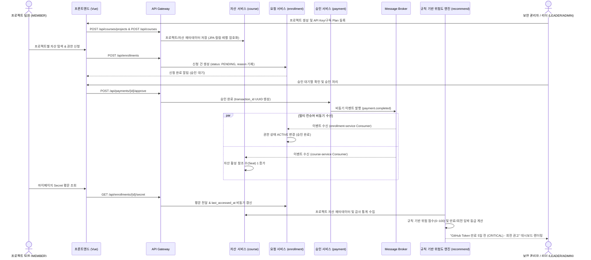

# 📋 [KeyNexus] 시스템 요구사항 정의서 (SRS)

## Software Requirements Specification: Enterprise Credential & Digital Asset Governance Platform

> **문서 버전**: v2.2.1 (Mermaid 관계선 방향 최적화: `projects` ➔ `users` 배치로 `projects` 최상단 수직 정렬 완벽 적용)  
> **작성 기준일**: 2026-08-27  
> **문서 책임자**: 30년차 시니어 PM / 기획 파트  
> **대상 독자**: 백엔드 엔지니어, 프론트엔드 엔지니어  
>  
> **문서 목적**: 본 문서는 KeyNexus 플랫폼 개발에 필요한 기능적/비기능적 요구사항, 데이터 모델, API 인터페이스 규격, UI/UX 흐름 및 트러블슈팅 기준을 정의한 **개발의 단일 진실 공급원(Single Source of Truth)**입니다.

---

# 📑 목차 (Table of Contents)

1. [시스템 개요 및 프로젝트 목표](#1-시스템-개요-및-프로젝트-목표)
2. [용어 정의 및 도메인 데이터 사전](#2-용어-정의-및-도메인-데이터-사전)
3. [시스템 아키텍처 및 네트워크 규격](#3-시스템-아키텍처-및-네트워크-규격)
4. [공통 인증 및 인가 규격 (Security Baseline)](#4-공통-인증-및-인가-규격-security-baseline)
5. [기능별 상세 요구사항 (Functional Requirements)](#5-기능별-상세-요구사항-functional-requirements)
   * 5.1 [FR-01] 계정 및 사용자 권한 관리 (`user-service`)
   * 5.2 [FR-02] 사내 프로젝트 & 디지털 자산(Credential) 카탈로그 관리 (`course-service`)
   * 5.3 [FR-03] 접근 권한 신청 및 라이프사이클 관리 (`enrollment-service`)
   * 5.4 [FR-04] 보안 검증 및 비동기 승인 발급 (`payment-service`)
   * 5.5 [FR-05] 규칙 기반(Rule-based) 위험도 산출 및 만료/회전 알림 거버넌스 (`recommend-service`)
6. [비기능 요구사항 (Non-Functional Requirements)](#6-비기능-요구사항-non-functional-requirements)
7. [데이터베이스 설계 및 스키마 명세](#7-데이터베이스-설계-및-스키마-명세)
8. [API 인터페이스 상세 규격서 (REST Contract)](#8-api-인터페이스-상세-규격서-rest-contract)
9. [이벤트 메시지 규격서 (Kafka Event Contract)](#9-이벤트-메시지-규격서-kafka-event-contract)
10. [화면 정의 및 프론트엔드 컴포넌트 설계](#10-화면-정의-및-프론트엔드-컴포넌트-설계)
11. [스프린트별 개발 범위 및 추적성 매트릭스 (Sprint Scope, Issue & DoD)](#11-스프린트별-개발-범위-및-추적성-매트릭스-sprint-scope-issue--dod)
12. [개발자 FAQ 및 트러블슈팅 가이드](#12-개발자-faq-및-트러블슈팅-가이드)

---

# 1. 시스템 개요 및 프로젝트 목표

### 1.1 시스템 개요

**KeyNexus**는 기업 내 분산되어 관리되던 각종 클라우드 IAM Key, 데이터베이스 계정, 외부 결제/통신 API Secret 등의 디지털 인증 자산(Credential) 및 B2B SaaS 구독 플랜을 최상위 사내 프로젝트(`projects`) 단위로 통제하고, 권한 요청-승인-회수의 전 과정을 체계적으로 관리하는 **사내 Credential 거버넌스 솔루션**입니다.

### 1.2 핵심 프로젝트 목표

1. **프로젝트 단위 가시성 확보 (Project-Centric Visibility)**: 최상위 사내 프로젝트별로 연결된 모든 Credential의 소유자, 용도, 만료일, 접근 권한자를 한 화면에서 통합 가시화.
2. **최소 권한 원칙 및 승인 기반 접근 (Least Privilege Access)**: 모든 자산 접근은 '신청 ➔ 승인' 단계를 거치며, 승인 완료 시 권한(`ACTIVE`)이 부여되고 관리자에 의해 명시적으로 회수(`CANCELLED`) 가능한 체계 구축.
3. **규칙 기반 지능형 거버넌스 (Rule-based Risk & Expiration Alerting)**: 백엔드가 객관적인 위험 규칙(만료 7/30일 전, 미회전 90/180일 경과, 다수 활성 사용자, 최근 접근 거절 이력 등)을 기반으로 0~100점의 위험 점수와 등급(LOW/MEDIUM/HIGH/CRITICAL)을 계산하고 만료/회전/갱신 권고 알림 리포트를 동적 제공.
4. **Agile & MSA 실증**: 5개 마이크로서비스 및 인프라 구조의 수정을 최소화하고, 도메인 매핑을 통해 즉시 가동 가능한 엔터프라이즈 플랫폼 구현.

---

# 2. 용어 정의 및 도메인 데이터 사전

### 2.1 핵심 비즈니스 용어 사전 (Glossary)

* **프로젝트 (Project)**: 거버넌스 및 자산 격리의 최상위 영역(Root Boundary)으로, 사내에서 진행되는 개발 프로젝트 또는 운영 서비스 단위를 의미합니다.
* **관리 자산 (Managed Asset)**: 프로젝트 하위에 속한 개체의 최상위 개념으로, '디지털 자산(Credential Asset)'과 '구독 플랜(Subscription Plan)'을 포괄합니다.
* **디지털 자산 (Credential Asset)**: DB 계정, API Key, AWS IAM Secret 등 접속 권한 키를 의미합니다.
* **구독 플랜 (Subscription Plan)**: GitHub Team, Datadog Pro, Figma Org 등 프로젝트 단위로 결제하여 사용 중인 B2B SaaS 라이선스를 의미합니다.
* **시트 (Seat)**: 자산을 사용 중인 프로젝트/사원의 수 (`enrollment_count`).
* **감사 로그 (Audit Log)**: API Key 조회, 회전, 폐기 및 접근 승인/거절 이력을 기록하는 위변조 불가 감사 이력.

### 2.2 도메인 개체 계층 및 클래스 다이어그램

최상위 개체인 `projects` (사내 프로젝트)가 최상단 거버넌스 경계(Root Boundary)에 배치되며, 하위에 `courses` (자산), `enrollments` (신청), `payments` (승인), `credential_audit_logs` (감사)가 수직 계층으로 연결됩니다. 각 컬럼 옆에는 레거시 DB 대비 변경 이력인 `(신규)`, `(유지)`, `(추가)`, `(수정)`, `(사용안함/제거)` 라벨이 기재되어 있습니다.

```mermaid
classDiagram
    direction TB

    class projects {
        <<사내 프로젝트 (Root Boundary) - [신규]>>
        +BIGINT id [PK] (신규)
        +String name [프로젝트명] (신규)
        +String description [프로젝트 설명] (신규)
        +BIGINT owner_id [책임자 FK] (신규)
        +String status [ACTIVE/ARCHIVED/CLOSED] (신규)
        +DATETIME created_at (신규)
        +DATETIME updated_at (신규)
    }

    class courses {
        <<관리 자산 (Credential & Subscription) - [수정]>>
        +BIGINT id [PK] (유지)
        +BIGINT project_id [소속 프로젝트 FK] (추가)
        +String title [자산명] (유지)
        +String description [용도/사용처] (유지)
        +String category [API_KEY/SUBSCRIPTION_PLAN/DB_CREDENTIAL] (수정)
        +String provider [제공자: GitHub, OpenAI 등] (추가)
        +String plan_name [구독 Plan명] (추가)
        +BIGINT instructor_id [자산 관리자 FK] (수정)
        +Integer enrollment_count [활성 참조수 / Seat] (유지)
        +DATETIME expires_at [Key 만료일] (추가)
        +DATETIME renewal_at [구독 갱신일] (추가)
        +DATETIME last_rotated_at [마지막 회전일] (추가)
        +String status [ACTIVE/INACTIVE/EXPIRED/REVOKED] (수정)
        +JSON metadata [암호화 메타데이터] (추가)
        +DATETIME created_at (유지)
        +DATETIME updated_at (유지)
        -Decimal price [보안 중요도 등급] (사용안함/제거)
    }

    class enrollments {
        <<접근 권한 요청 (Access Request) - [수정]>>
        +BIGINT id [PK] (유지)
        +BIGINT user_id [신청 사원 FK] (유지)
        +BIGINT course_id [대상 자산 FK] (유지)
        +String reason [신청 사유] (추가)
        +String status [PENDING/ACTIVE/CANCELLED] (수정)
        +DATETIME last_accessed_at [최근 접근일시] (추가)
        +DATETIME created_at (유지)
        +DATETIME updated_at (유지)
        -DATETIME expires_at [4시간 임시 만료일시] (사용안함/제거)
    }

    class payments {
        <<보안 검증 및 승인 감사 (Grant Ticket) - [수정]>>
        +BIGINT id [PK] (유지)
        +BIGINT enrollment_id [원본 신청 FK] (추가)
        +BIGINT user_id [신청 사원 FK] (유지)
        +BIGINT course_id [대상 자산 FK] (유지)
        +BIGINT approved_by [승인/거절 처리자 FK] (추가)
        +String status [PENDING/COMPLETED/FAILED/CANCELLED] (수정)
        +String transaction_id [감사 티켓 UUID] (수정)
        +String decision_reason [처리 사유] (추가)
        +DATETIME created_at (유지)
        +DATETIME updated_at (유지)
        -Decimal amount [결제 금액] (사용안함/제거)
        -DATETIME expires_at [승인 만료일시] (사용안함/제거)
    }

    class credential_audit_logs {
        <<감사 이력 (Audit Log) - [신규]>>
        +BIGINT id [PK] (신규)
        +CHAR(36) event_id [이벤트 UUID] (신규)
        +BIGINT course_id [대상 자산 FK] (신규)
        +BIGINT user_id [행위자 FK] (신규)
        +String action [행위 유형] (신규)
        +String result [SUCCESS/FAILURE/DENIED] (신규)
        +String source_ip [요청 IP] (신규)
        +Text detail [부가 정보] (신규)
        +DATETIME created_at (신규)
    }

    class users {
        <<사내 계정 (Actor) - [수정]>>
        +BIGINT id [PK] (유지)
        +String email (유지)
        +String password (유지)
        +String name (유지)
        +String role [ADMIN/SECURITY/LEADER/MEMBER] (수정)
        +DATETIME created_at (유지)
        +DATETIME updated_at (유지)
    }

    %% Core Asset Domain Hierarchy (Top-Down)
    projects "1" *-- "*" courses : 소속 자산 (project_id)
    courses "1" *-- "*" enrollments : 접근 신청 (course_id)
    enrollments "1" -- "1" payments : 승인 티켓 (enrollment_id)
    courses "1" *-- "*" credential_audit_logs : 감사 이력 기록 (course_id)

    %% User Interaction Links (Directed from Domain Entities to User Actor)
    projects "1" ..> "1" users : 프로젝트 책임자 (owner_id)
    courses "*" ..> "1" users : 자산 관리자 (instructor_id)
    enrollments "*" ..> "1" users : 접근 신청자 (user_id)
    payments "*" ..> "1" users : 승인자 (approved_by)
    credential_audit_logs "*" ..> "1" users : 행위자 (user_id)
```



### 2.3 핵심 유저 시나리오 전체 흐름 (Sequence Diagram)



---

# 3. 시스템 아키텍처 및 네트워크 규격

```text
                             [Client Browser]
                                     │ (HTTP / JSON)
                                     ▼
                   ┌───────────────────────────────────┐
                   │    Spring Cloud Gateway (:8080)   │
                   └─────────────────┬─────────────────┘
                                     │
         ┌───────────────┬───────────┼───────────────┬───────────────┐
         ▼               ▼           ▼               ▼               ▼
┌─────────────────┐┌──────────┐┌───────────┐┌─────────────────┐┌─────────────┐
│  user-service   ││  course  ││enrollment ││ payment-service ││ recommend-  │
│     (:8081)     ││ (:8082)  ││  (:8083)  ││     (:8084)     ││  service    │
│   (사내 계정)   ││(프로젝트/││(권한신청/ ││   (보안 승인/   ││   (:8085)   │
│                 ││ 자산관리)││ 권한보유) ││   감사티켓)     ││ (Rule Risk) │
└────────┬────────┘└────┬─────┘└─────┬─────┘└────────┬────────┘└──────┬──────┘
         │              │            │               │                │
         └──────────────┼────────────┴───────────────┴────────────────┘
                        ▼
       ┌─────────────────────────────────┐      ┌─────────────────────────────┐
       │   MariaDB 11.2 (:3306) (DB)     │      │   Kafka Broker (:9092)      │
       │   - Single Instance Shared      │      │   - Topic: payment.completed│
       │   - JPA Column Level Encryption │      │   - Topic: enroll.completed │
       └─────────────────────────────────┘      └─────────────────────────────┘
                                                       │
                                                 [Github Actions 자정 정합성 CRON]
```

* **Eureka Server**: `8761`
* **API Gateway**: `8080` (단일 진입점)

---

# 4. 공통 인증 및 인가 규격 (Security Baseline)

### 4.1 Gateway 헤더 전파

| 주입 헤더명 | 내용 | 예시 값 | 사용처 |
| :--- | :--- | :--- | :--- |
| **`X-User-Id`** | 사용자 고유 식별 번호 (Long) | `1` | 자산 등록자, 신청자, 승인자 식별 |
| **`X-User-Email`** | 사용자 이메일 계정 | `developer@company.com` | 감사 로그 기록 |
| **`X-User-Role`** | 사용자 권한 그룹 | `ROLE_ADMIN`, `ROLE_SECURITY`, `ROLE_LEADER`, `ROLE_MEMBER` | 인가(Authorization) 제어 |

---

# 5. 기능별 상세 요구사항 (Functional Requirements)

## 5.1 [FR-01] 계정 및 사용자 권한 관리 (`user-service`)

* **[수정] FR-01-01 [회원가입]**: 직원은 이메일, PW, 이름, 역할을 입력하여 계정을 생성한다. `ROLE`은 `ADMIN, SECURITY, LEADER, MEMBER`로 구성한다.
* **[완료] FR-01-02 [로그인 및 토큰 발급]**: 이메일/PW 로그인 시 JWT Access Token을 발급받는다.
* **[완료] FR-01-03 [내 정보 조회]**: 로그인된 사용자는 계정 정보 및 역할을 조회한다.

## 5.2 [FR-02] 사내 프로젝트 & 디지털 자산 카탈로그 관리 (`course-service`)

* **[work] FR-02-06 [프로젝트 생성 및 관리]**: 관리자/리더는 사내 프로젝트(`projects`)를 생성하고 관리할 수 있다.
* **[수정] FR-02-01 [프로젝트 연동 자산 등록]**: 리더 및 관리자는 특정 `projectId`에 속한 디지털 자산(API Key) 또는 구독 Plan을 등록한다. (기존 `price` 컬럼은 제거되며, JPA `@ColumnTransformer` 기반 레벨 암호화 적용).
* **[수정] FR-02-02 [프로젝트별 자산 목록 조회]**: 사용자는 프로젝트별/전체 자산 목록을 조회할 수 있다.
* **[완료] FR-02-03 [자산 상세 메타데이터 조회]**: 자산의 메타데이터, 제공자, 만료일, 갱신일, 소유자를 단건 조회한다.
* **[완료] FR-02-04 [카테고리/유형별 필터링]**: `API_KEY`, `SUBSCRIPTION_PLAN`, `DB_CREDENTIAL` 등 유형별 필터링을 제공한다.
* **[수정] FR-02-05 [활성 참조수 비동기 자동 갱신]**: Kafka `payment.completed` 수신 시 `enrollment_count`를 비동기로 1 증가시킨다.

## 5.3 [FR-03] 접근 권한 신청 및 라이프사이클 관리 (`enrollment-service`)

* **[수정] FR-03-01 [접근 권한 신청]**: 일반 개발자는 접근 목적(`reason`)을 기입하여 특정 자산의 사용 권한을 신청한다.
* **[완료] FR-03-02 [내 신청 내역 조회]**: 본인의 자산 신청 내역과 상태(`PENDING` / `ACTIVE` / `CANCELLED`)를 조회한다.
* **[work] FR-03-03 [비동기 상태 전이 수신 및 권한 활성화]**: 승인 완료 Kafka 이벤트 수신 시 해당 신청 건의 상태를 `ACTIVE`로 변경하여 자산 접근 권한을 활성화한다.
* **[work] FR-03-04 [Secret 평문 조회 & 최근 접근일시 비동기 갱신]**: `ACTIVE` 권한을 보유한 사원이 Secret 평문을 조회할 때 `last_accessed_at`을 비동기 갱신한다.
* **[수정] FR-03-05 [명시적 권한 회수 및 취소]**: 관리자의 권한 회수 액션 또는 사용자의 취소 시 해당 신청 건 상태를 `CANCELLED`로 변경하고 Seat 수(-1)를 차감한다.

## 5.4 [FR-04] 보안 검증 및 비동기 승인 발급 (`payment-service`)

* **[work] FR-04-01 [보안 승인 처리 및 감사 티켓 생성]**: 관리자가 접근 신청을 승인/거절할 수 있으며, 승인 완료 시 감사 티켓 UUID(`transaction_id`), 승인자(`approved_by`), 승인사유(`decision_reason`)를 기록한다. (기존 `amount` 컬럼 제거).
* **[work] FR-04-02 [승인 완료 이벤트 비동기 발행]**: 승인 처리 완료 즉시 Kafka `payment.completed` 토픽으로 이벤트를 발행한다.
* **[완료] FR-04-03 [승인 내역 단건 조회]**: 감사 티켓 및 승인 상세 내역을 조회한다.
* **[work] FR-04-04 [감사 이력 관리]**: Key 조회, 회전, 폐기 및 승인/거절 이력을 `credential_audit_logs`에 기록하고 조회한다.

## 5.5 [FR-05] 규칙 기반(Rule-based) 위험도 산출 및 만료/회전 알림 거버넌스 (`recommend-service`)

* **[work] FR-05-01 [규칙 기반 위험 점수 및 등급 계산]**: 
  - 백엔드 규칙 엔진이 API Key 만료 임박(7일 이내 +40, 30일 이내 +20), 회전 주기 경과(180일 초과 +25, 90일 초과 +15), 활성 접근자 수(5명 이상 +15), 최근 접근 거절(3회 이상 +20) 등의 객관적 수식으로 0~100점의 위험 점수 및 `LOW / MEDIUM / HIGH / CRITICAL` 등급을 산출한다.
* **[work] FR-05-02 [API Key 만료/회전 및 구독 Plan 갱신 알림 리포트]**: 
  - 만료 임박 API Key, 회전 필요 Key, 갱신 임박 구독 Plan을 식별하여 관리자가 수행할 우선순위 조치 가이드를 동적 생성한다.
* **[work] FR-05-03 [FastAPI 위험 분석 및 알림 API]**: 
  - FastAPI 기반으로 `POST /api/recommend/projects/{projectId}/analyze`, `GET /api/recommend/projects/{projectId}/risks`, `GET /api/recommend/projects/{projectId}/expiring-keys`, `GET /api/recommend/projects/{projectId}/renewing-plans` API를 제공한다.

---

# 6. 비기능 요구사항 (Non-Functional Requirements)

| 항목 | 요구사항 기준 |
| :--- | :--- |
| **성능 (Performance)** | Gateway 경유 REST API 응답 시간 p95 300ms 이내. |
| **보안 (Security)** | 1. 패스워드 BCrypt 해시 저장.<br>2. JPA `@ColumnTransformer`를 활용한 `courses` Secret 메타데이터 레벨 암호화.<br>3. 승인 기반 인가 통제 및 감사 로그 기록.<br>4. 감사 로그에 Secret 평문/암호화 키 기록 전면 금지. |
| **장애 격리 (Fault Tolerance)** | Kafka 브로커 장애 또는 Recommend 서비스 다운 시에도 프로젝트/자산 CRUD 및 접근 신청(Sprint 1 영역)은 정상 작동. |
| **데이터 무결성 (Data Integrity)** | 1. Secret 평문 조회 시 `last_accessed_at` 접속 로그 비동기 갱신.<br>2. 매일 자정 GitHub Actions 자가 치유(Self-healing) CRON을 통해 `courses` Seat 수와 `enrollments` 데이터 정합성 동기화. |
| **확장성 (Scalability)** | 모든 마이크로서비스는 Stateless 컨테이너 구조로 수평 확장 가능. |

---

# 7. 데이터베이스 설계 및 스키마 명세 (DDL)

```sql
-- 1. 사내 프로젝트 테이블 (Root Boundary) - [신규]
CREATE TABLE IF NOT EXISTS projects (
    id          BIGINT          NOT NULL AUTO_INCREMENT,
    name        VARCHAR(150)    NOT NULL UNIQUE COMMENT '프로젝트명 (신규)',
    description TEXT            NULL COMMENT '프로젝트 설명 (신규)',
    owner_id    BIGINT          NOT NULL COMMENT '프로젝트 책임자 (users.id FK) (신규)',
    status      VARCHAR(20)     NOT NULL DEFAULT 'ACTIVE' COMMENT 'ACTIVE | ARCHIVED | CLOSED (신규)',
    created_at  DATETIME(6)     NULL DEFAULT CURRENT_TIMESTAMP(6),
    updated_at  DATETIME(6)     NULL DEFAULT CURRENT_TIMESTAMP(6) ON UPDATE CURRENT_TIMESTAMP(6),
    PRIMARY KEY (id),
    FOREIGN KEY (owner_id) REFERENCES users(id)
) ENGINE=InnoDB DEFAULT CHARSET=utf8mb4;

-- 2. 사내 계정 테이블 - [수정]
CREATE TABLE IF NOT EXISTS users (
    id          BIGINT          NOT NULL AUTO_INCREMENT,
    email       VARCHAR(255)    NOT NULL UNIQUE,
    password    VARCHAR(255)    NOT NULL,
    name        VARCHAR(100)    NOT NULL,
    role        VARCHAR(20)     NOT NULL COMMENT 'ADMIN | SECURITY | LEADER | MEMBER (수정)',
    created_at  DATETIME(6)     NULL DEFAULT CURRENT_TIMESTAMP(6),
    updated_at  DATETIME(6)     NULL DEFAULT CURRENT_TIMESTAMP(6) ON UPDATE CURRENT_TIMESTAMP(6),
    PRIMARY KEY (id)
) ENGINE=InnoDB DEFAULT CHARSET=utf8mb4;

-- 3. 디지털 자산 및 구독 관리 테이블 (courses 재사용) - [수정]
CREATE TABLE IF NOT EXISTS courses (
    id                     BIGINT          NOT NULL AUTO_INCREMENT,
    project_id             BIGINT          NOT NULL COMMENT '소속 프로젝트 (projects.id FK) (추가)',
    title                  VARCHAR(255)    NOT NULL COMMENT '자산명 / 솔루션명 (유지)',
    description            TEXT            NULL COMMENT '자산 용도 및 설명 (유지)',
    category               VARCHAR(50)     NOT NULL COMMENT 'API_KEY | SUBSCRIPTION_PLAN | DB_CREDENTIAL (수정)',
    provider               VARCHAR(100)    NOT NULL COMMENT '제공자 (GitHub, OpenAI, AWS 등) (추가)',
    plan_name              VARCHAR(100)    NULL COMMENT '구독 Plan 명 (Team, Pro 등) (추가)',
    instructor_id          BIGINT          NOT NULL COMMENT '자산 관리자 (users.id FK) (수정)',
    enrollment_count       INT             NOT NULL DEFAULT 0 COMMENT '발급된 활성 Seat 수 (유지)',
    expires_at             DATETIME(6)     NULL COMMENT 'API Key 만료 예정일 (추가)',
    renewal_at             DATETIME(6)     NULL COMMENT '구독 Plan 갱신 예정일 (추가)',
    last_rotated_at        DATETIME(6)     NULL COMMENT '마지막 API Key 회전일 (추가)',
    status                 VARCHAR(20)     NOT NULL DEFAULT 'ACTIVE' COMMENT 'ACTIVE | INACTIVE | EXPIRED | REVOKED (수정)',
    metadata               JSON            NULL COMMENT '자산 메타데이터 (JPA 레벨 암호화) (추가)',
    created_at             DATETIME(6)     NULL DEFAULT CURRENT_TIMESTAMP(6),
    updated_at             DATETIME(6)     NULL DEFAULT CURRENT_TIMESTAMP(6) ON UPDATE CURRENT_TIMESTAMP(6),
    PRIMARY KEY (id),
    FOREIGN KEY (project_id) REFERENCES projects(id),
    FOREIGN KEY (instructor_id) REFERENCES users(id)
    -- price DECIMAL 컬럼은 사용안함/제거됨
) ENGINE=InnoDB DEFAULT CHARSET=utf8mb4;

-- 4. 자산 접근 권한 신청 테이블 (enrollments 재사용) - [수정]
CREATE TABLE IF NOT EXISTS enrollments (
    id                BIGINT      NOT NULL AUTO_INCREMENT,
    user_id           BIGINT      NOT NULL COMMENT '신청 사원 (users.id FK) (유지)',
    course_id         BIGINT      NOT NULL COMMENT '대상 자산 (courses.id FK) (유지)',
    reason            TEXT        NULL COMMENT '접근 요청 사유 (추가)',
    status            VARCHAR(20) NOT NULL DEFAULT 'PENDING' COMMENT 'PENDING | ACTIVE | CANCELLED (수정)',
    last_accessed_at  DATETIME(6) NULL COMMENT '최근 Secret 평문 조회 일시 (추가)',
    created_at        DATETIME(6) NULL DEFAULT CURRENT_TIMESTAMP(6),
    updated_at        DATETIME(6) NULL DEFAULT CURRENT_TIMESTAMP(6) ON UPDATE CURRENT_TIMESTAMP(6),
    PRIMARY KEY (id),
    UNIQUE KEY uq_user_course (user_id, course_id),
    FOREIGN KEY (user_id) REFERENCES users(id),
    FOREIGN KEY (course_id) REFERENCES courses(id)
    -- expires_at DATETIME 컬럼은 임시접근권 제거로 사용안함/제거됨
) ENGINE=InnoDB DEFAULT CHARSET=utf8mb4;

-- 5. 보안 검증 및 승인 감사 테이블 (payments 재사용) - [수정]
CREATE TABLE IF NOT EXISTS payments (
    id               BIGINT       NOT NULL AUTO_INCREMENT,
    enrollment_id    BIGINT       NOT NULL UNIQUE COMMENT '원본 신청 (enrollments.id FK) (추가)',
    user_id          BIGINT       NOT NULL COMMENT '신청 사원 (users.id FK) (유지)',
    course_id        BIGINT       NOT NULL COMMENT '대상 자산 (courses.id FK) (유지)',
    approved_by      BIGINT       NULL COMMENT '승인/거절 처리자 (users.id FK) (추가)',
    status           VARCHAR(20)  NOT NULL DEFAULT 'PENDING' COMMENT 'PENDING | COMPLETED | FAILED | CANCELLED (수정)',
    transaction_id   VARCHAR(255) UNIQUE COMMENT '보안 감사 티켓 UUID (수정)',
    decision_reason  TEXT         NULL COMMENT '승인 또는 거절 사유 (추가)',
    created_at       DATETIME(6)  NULL DEFAULT CURRENT_TIMESTAMP(6),
    updated_at       DATETIME(6)  NULL DEFAULT CURRENT_TIMESTAMP(6) ON UPDATE CURRENT_TIMESTAMP(6),
    PRIMARY KEY (id),
    FOREIGN KEY (enrollment_id) REFERENCES enrollments(id),
    FOREIGN KEY (user_id) REFERENCES users(id),
    FOREIGN KEY (course_id) REFERENCES courses(id),
    FOREIGN KEY (approved_by) REFERENCES users(id)
    -- amount DECIMAL 및 expires_at 컬럼은 사용안함/제거됨
) ENGINE=InnoDB DEFAULT CHARSET=utf8mb4;

-- 6. 감사 이력 테이블 - [신규]
CREATE TABLE IF NOT EXISTS credential_audit_logs (
    id          BIGINT          NOT NULL AUTO_INCREMENT,
    event_id    CHAR(36)        NOT NULL UNIQUE COMMENT '감사 이벤트 UUID (신규)',
    course_id   BIGINT          NULL COMMENT '관련 자산 (courses.id FK) (신규)',
    user_id     BIGINT          NULL COMMENT '행위자 (users.id FK) (신규)',
    action      VARCHAR(50)     NOT NULL COMMENT '행위 유형 (REVEALED, ROTATED, REVOKED 등) (신규)',
    result      VARCHAR(20)     NOT NULL COMMENT 'SUCCESS | FAILURE | DENIED (신규)',
    source_ip   VARCHAR(45)     NULL COMMENT '요청 IP (신규)',
    detail      TEXT            NULL COMMENT 'Secret을 제외한 상세설명 (신규)',
    created_at  DATETIME(6)     NOT NULL DEFAULT CURRENT_TIMESTAMP(6),
    PRIMARY KEY (id),
    FOREIGN KEY (course_id) REFERENCES courses(id),
    FOREIGN KEY (user_id) REFERENCES users(id)
) ENGINE=InnoDB DEFAULT CHARSET=utf8mb4;
```

---

# 8. API 인터페이스 상세 규격서 (REST Contract)

### 8.1 프로젝트 & 자산 카탈로그 API (`course-service`)

* **[POST] `/api/courses/projects` — 신규 프로젝트 생성**
* **[GET] `/api/courses/projects` — 프로젝트 목록 조회**
* **[GET] `/api/courses` — 전체/프로젝트별 자산 목록 조회**
* **[POST] `/api/courses` — 신규 Credential 자산 등록**

### 8.2 접근 권한 신청 API (`enrollment-service`)

* **[POST] `/api/enrollments` — 자산 접근 권한 신청**
* **[GET] `/api/enrollments/my` — 내 자산 권한 목록 조회**
* **[GET] `/api/enrollments/{id}/secret` — Secret 평문 조회 (last_accessed_at 갱신)**

### 8.3 보안 승인 API (`payment-service`)

* **[POST] `/api/payments/{id}/approve` — 승인 처리 및 Kafka 이벤트 발행**
* **[POST] `/api/payments/{id}/revoke` — 보유 권한 명시적 회수**

### 8.4 규칙 기반 위험도 & 만료 알림 API (`recommend-service`)

* **[POST] `/api/recommend/projects/{projectId}/analyze` — 프로젝트 위험도 분석 및 알림 리포트 반환**

---

# 9. 이벤트 메시지 규격서 (Kafka Event Contract)

### 9.1 토픽: `payment.completed` (보안 승인 완료 이벤트)

* **Producer**: `payment-service` | **Consumer**: `enrollment-service`, `course-service`
* **Payload**:
```json
{
  "paymentId": 100,
  "enrollmentId": 10,
  "userId": 1,
  "courseId": 1,
  "transactionId": "sec-grant-uuid-88392",
  "status": "COMPLETED",
  "timestamp": "2026-08-27T10:00:00"
}
```

---

# 10. 화면 정의 및 프론트엔드 컴포넌트 설계

### 10.1 라우팅 맵

| 라우트 경로 | 뷰 컴포넌트 | 화면 명칭 | 접근 권한 | 주요 기능 |
| :--- | :--- | :--- | :---: | :--- |
| `/` | `LandingView.vue` | 메인 랜딩 포털 | All | 프로젝트 현황 & 자산 요약 |
| `/login` | `LoginView.vue` | 사내 SSO 로그인 | All | 로그인 & 토큰 발급 |
| `/projects` | `ProjectListView.vue` | 프로젝트 목록 뷰 | Auth | 프로젝트 생성 및 목록 탐색 |
| `/courses` | `CourseListView.vue` | 자산 카탈로그 뷰 | Auth | 자산 탐색, 필터링, 카드 뷰 |
| `/courses/:id` | `CourseDetailView.vue` | 자산 상세 & 권한 신청 | Auth | 자산 메타데이터, \[접근 신청] |
| `/mypage` | `MyPageView.vue` | 내 자산함 & 위험도 대시보드 | Auth | Secret 마스킹 해제 뷰어, 위험도/만료 알림 위젯 |

---

# 11. 스프린트별 개발 범위 및 추적성 매트릭스 (Sprint Scope, Issue & DoD)

### 📌 Sprint 1: 프로젝트 & 자산 카탈로그 구축 및 기본 권한 신청 (MVP)

| 이슈 ID | 세부 작업 내용 | 요구사항 매핑 (Traceability) |
| :--- | :--- | :--- |
| **Issue-0** | Swagger API 명세 및 Mock Server 구성 | `NFR-성능`, `NFR-확장성` |
| **Issue-1** | `projects` & `courses` DDL 작성 및 JPA `@ColumnTransformer` 암호화 적용 | `FR-02-01`, `FR-02-06`, `NFR-보안` |
| **Issue-2** | `user-service` 로그인/회원가입/내정보 조회 (ROLE 체계 정비) | `FR-01-01`, `FR-01-02`, `FR-01-03`, `NFR-보안` |
| **Issue-3** | `course-service` 프로젝트 & 자산 CRUD REST API 구현 | `FR-02-01`, `FR-02-02`, `FR-02-03`, `FR-02-04`, `FR-02-06` |
| **Issue-4** | `enrollment-service` 접근 권한 신청 & 내 신청 조회 API 구현 | `FR-03-01`, `FR-03-02` |
| **Issue-5** | 프론트엔드 라우터 및 공통 디자인 시스템 구축 | `NFR-확장성` |
| **Issue-6** | 프론트엔드 로그인 & 메인 포털 뷰 구현 | `FR-01-02` |
| **Issue-7** | 프론트엔드 프로젝트 & 자산 카탈로그 필터링 뷰 구현 | `FR-02-02`, `FR-02-04`, `FR-02-06` |
| **Issue-8** | 프론트엔드 자산 상세 & 권한 신청 모달 구현 | `FR-02-03`, `FR-03-01` |
| **Issue-9** | 프론트엔드 신규 프로젝트 등록 모달 구현 | `FR-02-06` |

---

### 📌 Sprint 2: 비동기 보안 승인 & 규칙 기반 위험도/만료 알림 거버넌스

| 이슈 ID | 세부 작업 내용 | 요구사항 매핑 (Traceability) |
| :--- | :--- | :--- |
| **Issue-10** | `payment-service` 보안 승인/거절 API & 감사 티켓 UUID 발급 | `FR-04-01`, `FR-04-03` |
| **Issue-11** | `payment-service` Kafka `payment.completed` 이벤트 발행 (Producer) | `FR-04-02`, `NFR-장애격리` |
| **Issue-12** | Kafka 멀티 컨슈머 연동 (`enrollment` ACTIVE 활성화 & `course` Seat 증가) | `FR-02-05`, `FR-03-03`, `NFR-장애격리` |
| **Issue-12b**| Secret 평문 조회 API & `last_accessed_at` 비동기 갱신 구현 | `FR-03-04`, `NFR-보안`, `NFR-무결성` |
| **Issue-12c**| 감사 로그(`credential_audit_logs`) 적재 및 조회 API | `FR-04-04`, `NFR-보안` |
| **Issue-13** | FastAPI `recommend-service` 규칙 기반 Risk Engine & 알림 API | `FR-05-01`, `FR-05-02`, `FR-05-03`, `NFR-성능` |
| **Issue-14** | GitHub Actions 자정 자가 치유(Self-healing) CRON 동기화 | `FR-03-05`, `NFR-무결성` |
| **Issue-15** | 프론트엔드 Secret 마스킹 해제 뷰어 UI 구현 | `FR-03-03`, `FR-03-04` |
| **Issue-16** | 프론트엔드 마이페이지 보유 자산 현황 뷰어 구현 | `FR-03-02` |
| **Issue-17** | 프론트엔드 프로젝트 위험도 및 만료 알림 대시보드 위젯 구현 | `FR-05-01`, `FR-05-02`, `FR-05-03` |

---

# 12. 개발자 FAQ 및 트러블슈팅 가이드

* **Q1. `projects`와 `courses`의 관계는 어떻게 처리하나요?**  
  `courses.project_id` FK를 통해 `courses` 자산이 특정 프로젝트에 종속되도록 설정하며, 프로젝트 생성 후 자산을 등록합니다.
* **Q2. `price`나 `amount` 컬럼이 코드에 남아있는 경우 어떻게 처리하나요?**  
  Credential 도메인에 부합하지 않으므로 완전히 제거되었으며, 필요시 위험 점수(`riskScore`)를 recommend-service에서 동적 계산합니다.

***
> **[PM 서명]**  
> 본 요구사항 정의서 v2.2.1은 KeyNexus 프로젝트의 공식 단일 진실 공급원(SSOT) 문서입니다.
