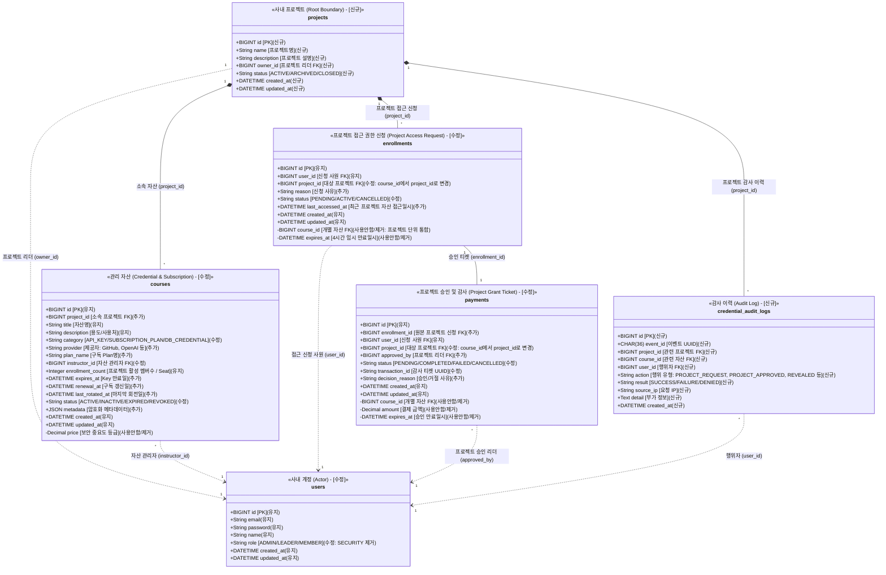
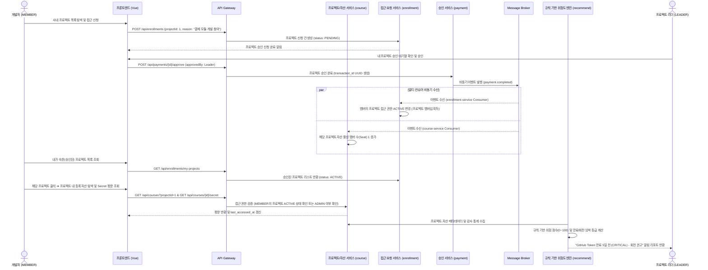

# 📋 [KeyNexus] 시스템 요구사항 정의서 (SRS)

## Software Requirements Specification: Enterprise Credential & Digital Asset Governance Platform

> **문서 버전**: v3.2.0 (`[work]` 상세 구현방법/기술 명시, Sec 2.3 도메인 동기화 복구, Sec 2.4 시퀀스 다이어그램 독립 구성 및 FR-05 규칙 기반 전환 상세 복원)  
> **작성 기준일**: 2026-08-27  
> **문서 책임자**: 30년차 시니어 PM / 기획 파트  
> **대상 독자**: 백엔드 엔지니어, 프론트엔드 엔지니어  
>  
> **문서 목적**: 본 문서는 KeyNexus 플랫폼 개발에 필요한 기능적/비기능적 요구사항, 데이터 모델, API 인터페이스 규격, UI/UX 흐름 및 트러블슈팅 기준을 정의한 **개발의 단일 진실 공급원(Single Source of Truth)**입니다.

---

# 📑 목차 (Table of Contents)

1. [시스템 개요 및 프로젝트 목표](#1-시스템-개요-및-프로젝트-목표)
2. [용어 정의 및 도메인 데이터 사전](#2-용어-정의-및-도메인-데이터-사전)
   * 2.1 [핵심 비즈니스 용어 사전 (Glossary)](#21-핵심-비즈니스-용어-사전-glossary)
   * 2.2 [도메인 개체 계층 및 클래스 다이어그램](#22-도메인-개체-계층-및-클래스-다이어그램)
   * 2.3 [도메인 용어 코드 레벨 동기화](#23-도메인-용어-코드-레벨-동기화)
   * 2.4 [핵심 유저 시나리오 전체 흐름 (Sequence Diagram)](#24-핵심-유저-시나리오-전체-흐름-sequence-diagram)
3. [시스템 아키텍처 및 네트워크 규격](#3-시스템-아키텍처-및-네트워크-규격)
4. [공통 인증 및 인가 규격 (Security Baseline)](#4-공통-인증-및-인가-규격-security-baseline)
5. [기능별 상세 요구사항 (Functional Requirements)](#5-기능별-상세-요구사항-functional-requirements)
   * 5.1 [FR-01] 계정 및 사용자 권한 관리 (`user-service`)
   * 5.2 [FR-02] 사내 프로젝트 & 디지털 자산(Credential) 카탈로그 관리 (`course-service`)
   * 5.3 [FR-03] 프로젝트 접근 권한 신청 및 멤버십 관리 (`enrollment-service`)
   * 5.4 [FR-04] 프로젝트 보안 검증 및 비동기 승인 발급 (`payment-service`)
   * 5.5 [FR-05] 규칙 기반(Rule-based) Credential 위험도 산출 및 만료/회전 알림 거버넌스 (`recommend-service`)
6. [비기능 요구사항 (Non-Functional Requirements)](#6-비기능-요구사항-non-functional-requirements)
7. [데이터베이스 설계 및 스키마 명세](#7-데이터베이스-설계-및-스키마-명세)
8. [API 인터페이스 상세 규격서 (REST Contract)](#8-api-인터페이스-상세-규격서-rest-contract)
9. [이벤트 메시지 규격서 (Kafka Event Contract)](#9-이벤트-메시지-규격서-kafka-event-contract)
10. [화면 정의 및 프론트엔드 컴포넌트 설계](#10-화면-정의-및-프론트엔드-컴포넌트-설계)
11. [스프린트별 개발 범위 및 추적성 매트릭스 (Sprint Scope, Issue & DoD)](#11-스프린트별-개발-범위-및-추적성-매트릭스-sprint-scope-issue--dod)
12. [개발자 FAQ 및 트러블슈팅 가이드](#12-개발자-faq-및-트러블슈팅-가이드)

---

# 1. 시스템 개요 및 프로젝트 목표

### 1.1 시스템 개요

**KeyNexus**는 기업 내 분산되어 관리되던 각종 클라우드 IAM Key, 데이터베이스 계정, 외부 결제/통신 API Secret 등의 디지털 인증 자산(Credential) 및 B2B SaaS 구독 플랜을 최상위 사내 프로젝트(`projects`) 단위로 통제하고, 프로젝트 접근 요청-프로젝트 리더 승인-프로젝트 내 자산 활용의 전 과정을 체계적으로 관리하는 **사내 Credential 거버넌스 솔루션**입니다.

### 1.2 핵심 프로젝트 목표

1. **프로젝트 단위 거버넌스 및 가시성 (Project-Level Governance)**: 
   - 사내 프로젝트별로 권한 경계를 설정하여, 프로젝트 리더(`LEADER`)가 신청한 멤버(`MEMBER`)의 프로젝트 접근 요청을 승인하면, 승인된 멤버는 해당 프로젝트 내 등록된 모든 Credential 자산 및 구독 플랜에 자유롭게 접근 가능.
   - 전사 관리자(`ADMIN`)는 모든 프로젝트 및 자산에 사전 승인 없이 즉시 접근 및 관리가 가능.
2. **역할 기반 인가 (Role-Based Access Control)**:
   - `ADMIN`: 전사 관리자 (모든 프로젝트 및 자산 자동 접근 및 관리)
   - `LEADER`: 프로젝트 책임자 (본인 소속 프로젝트 자산 등록 및 프로젝트 접근 신청 승인/거절)
   - `MEMBER`: 개발자/팀원 (내가 속한 프로젝트 조회 ➔ 프로젝트 승인 후 프로젝트 내 관리 자산 활용)
3. **규칙 기반 지능형 거버넌스 (Rule-based Risk & Expiration Alerting)**: 백엔드가 객관적인 위험 규칙(만료 7/30일 전, 미회전 90/180일 경과, 다수 활성 사용자, 최근 접근 거절 이력 등)을 기반으로 0~100점의 위험 점수와 등급(LOW/MEDIUM/HIGH/CRITICAL)을 계산하고 알림 리포트를 동적 제공.
4. **Agile & MSA 실증**: 5개 마이크로서비스 및 인프라 구조의 수정을 최소화하고, 도메인 매핑을 통해 즉시 가동 가능한 엔터프라이즈 플랫폼 구현.

---

# 2. 용어 정의 및 도메인 데이터 사전

### 2.1 핵심 비즈니스 용어 사전 (Glossary)

* **프로젝트 (Project)**: 거버넌스 및 자산 권한 격리의 최상위 영역(Root Boundary)으로, 프로젝트 리더(`owner_id`)가 관리합니다.
* **프로젝트 접근 권한 (Project Access Grant)**: 개발자(`MEMBER`)가 특정 프로젝트에 대해 요청하여 프로젝트 리더(`LEADER`)의 승인을 받아 획득하는 프로젝트 단위 접근 자격입니다.
* **관리 자산 (Managed Asset)**: 프로젝트 하위에 속한 개체로, '디지털 자산(Credential Asset)'과 '구독 플랜(Subscription Plan)'을 포괄합니다. 프로젝트 승인을 받은 멤버는 소속 프로젝트의 자산을 이용할 수 있습니다.
* **시트 (Seat)**: 프로젝트 접근 승인을 받은 활성 멤버의 수 (`enrollment_count`).
* **감사 로그 (Audit Log)**: 프로젝트 접근 승인/거절, API Key 조회, 회전, 폐기 이력을 기록하는 위변조 불가 감사 이력.

### 2.2 도메인 개체 계층 및 클래스 다이어그램

최상위 개체인 `projects` (사내 프로젝트)가 최상단 거버넌스 경계(Root Boundary)에 배치되며, 하위에 `courses` (소속 자산), `enrollments` (프로젝트 접근 신청), `payments` (프로젝트 리더 승인), `credential_audit_logs` (감사 이력)가 수직 계층으로 연결됩니다. 각 컬럼 옆에는 레거시 DB 대비 변경 이력인 `(신규)`, `(유지)`, `(추가)`, `(수정)`, `(사용안함/제거)` 라벨이 기재되어 있습니다.



### 2.3 도메인 용어 코드 레벨 동기화

목적: 개발 과정에서 기존 레거시 템플릿의 물리 명칭(`courses`, `enrollments`, `payments`)과 Credential 도메인 용어 간의 혼란을 방지합니다.

1. **API 스펙(Swagger)에 도메인 용어 강제 노출**
   - 백엔드 DTO(Data Transfer Object) 정의 시, `@Schema` 어노테이션의 `description` 속성 최상단에 **[도메인 용어]를 대괄호로 기재**하여 Swagger UI에 강제 노출합니다.
   - *예시:* `@Schema(description = "[프로젝트 자산] 특정 프로젝트(projects.id)에 종속된 디지털 자산 및 구독 플랜 메타데이터")`
2. **코드 내 커스텀 어노테이션(`@DomainTerm`) 도입**
   - 백엔드 엔티티 클래스 및 필드 상단에 `@DomainTerm("사내 프로젝트")`, `@DomainTerm("프로젝트 접근 권한")`과 같은 주석용 커스텀 어노테이션을 부착하여, IDE에서 커서를 올렸을 때 비즈니스 의미가 툴팁으로 바로 보이도록 구성합니다.

### 2.4 핵심 유저 시나리오 전체 흐름 (Sequence Diagram)

다음은 개발자(`MEMBER`)가 프로젝트 접근 권한을 신청하고, 프로젝트 리더(`LEADER`)가 승인하며, 규칙 기반 위험도 엔진(`recommend-service`)이 동작하는 전체 흐름입니다.



---

# 3. 시스템 아키텍처 및 네트워크 규격

```text
                             [Client Browser]
                                     │ (HTTP / JSON)
                                     ▼
                   ┌───────────────────────────────────┐
                   │    Spring Cloud Gateway (:8080)   │
                   └─────────────────┬─────────────────┘
                                     │
         ┌───────────────┬───────────┼───────────────┬───────────────┐
         ▼               ▼           ▼               ▼               ▼
┌─────────────────┐┌──────────┐┌───────────┐┌─────────────────┐┌─────────────┐
│  user-service   ││  course  ││enrollment ││ payment-service ││ recommend-  │
│     (:8081)     ││ (:8082)  ││  (:8083)  ││     (:8084)     ││  service    │
│   (사내 계정)   ││(프로젝트/││(프로젝트  ││  (프로젝트 승인/││   (:8085)   │
│                 ││ 자산관리)││ 접근권한) ││   감사티켓)     ││ (Rule Risk) │
└────────┬────────┘└────┬─────┘└─────┬─────┘└────────┬────────┘└──────┬──────┘
         │              │            │               │                │
         └──────────────┼────────────┴───────────────┴────────────────┘
                        ▼
       ┌─────────────────────────────────┐      ┌─────────────────────────────┐
       │   MariaDB 11.2 (:3306) (DB)     │      │   Kafka Broker (:9092)      │
       │   - Single Instance Shared      │      │   - Topic: payment.completed│
       │   - JPA Column Level Encryption │      │   - Topic: enroll.completed │
       └─────────────────────────────────┘      └─────────────────────────────┘
                                                       │
                                                 [Github Actions 자정 정합성 CRON]
```

---

# 4. 공통 인증 및 인가 규격 (Security Baseline)

### 4.1 Gateway 헤더 전파 및 역할 정의

| 주입 헤더명 | 내용 | 예시 값 | 역할 및 인가(Authorization) 규칙 |
| :--- | :--- | :--- | :--- |
| **`X-User-Id`** | 사용자 식별 번호 (Long) | `1` | 등록자, 신청자, 승인자 식별 |
| **`X-User-Email`** | 이메일 계정 | `developer@company.com` | 감사 로그 기록 |
| **`X-User-Role`** | 권한 그룹 | `ROLE_ADMIN`, `ROLE_LEADER`, `ROLE_MEMBER` | **`ADMIN`**: 전사 모든 프로젝트/자산 즉시 접근 가능<br>**`LEADER`**: 본인 프로젝트 생성/자산 등록 및 프로젝트 접근 승인 권한<br>**`MEMBER`**: 프로젝트 접근 신청 ➔ 승인 후 소속 프로젝트 자산 활용 |

---

# 5. 기능별 상세 요구사항 (Functional Requirements)

> **[기능 구현 라벨 분류 기준]**
>
> * **[완료]**: 기존 템플릿(강의 플랫폼)에 이미 구현되어 있어 즉시 사용 가능한 기존 기능
> * **[수정]**: 기존 템플릿 기능에서 도메인(DB 구조, DTO, 텍스트, 파라미터) 변경이 일어나는 기능
> * **[work]**: 기존 템플릿에 없거나 큰 단위의 작업이 필요한 신규 기능 (사용 기술 및 구현 방법 명시)

## 5.1 [FR-01] 계정 및 사용자 권한 관리 (`user-service`)

* **[수정] FR-01-01 [회원가입 및 역할 정의]**
  * **요구사항**: 사내 직원은 이메일, 비밀번호, 이름, 역할을 입력하여 계정을 생성한다.
  * **구현 방안**: 템플릿 코드의 `POST /api/users/register` 및 `User.java` 엔티티를 활용하되, 기존 `STUDENT, INSTRUCTOR` 2단계 역할 체계를 `ADMIN, LEADER, MEMBER` 3단계 체계로 변경하여 스프링 시큐리티 인가 설정에 반영합니다.
* **[완료] FR-01-02 [로그인 및 토큰 발급]**
  * **요구사항**: 이메일과 비밀번호로 로그인 시 JWT Access Token을 발급받는다.
  * **구현 방안**: 템플릿 코드의 `POST /api/users/login` 및 `auth-server` OAuth2 / JWT 발급 파이프라인이 그대로 구동되므로 완벽히 동작합니다.
* **[완료] FR-01-03 [내 정보 조회]**
  * **요구사항**: 로그인된 사용자는 JWT 토큰을 기반으로 본인의 계정 정보 및 역할을 조회할 수 있다.
  * **구현 방안**: 템플릿 코드의 `GET /api/users/me` 컨트롤러 및 JWT sub 클레임 로직을 그대로 사용합니다.

## 5.2 [FR-02] 사내 프로젝트 & 디지털 자산 카탈로그 관리 (`course-service`)

* **[work] FR-02-06 [프로젝트 생성 및 관리]**
  * **요구사항**: 리더(`LEADER`) 및 관리자(`ADMIN`) 권한을 가진 사용자만 신규 사내 프로젝트(`projects`)를 생성하고 관리할 수 있다.
  * **사용 기술**: Java 21, Spring Boot 3.4.x, Spring Data JPA, MariaDB
  * **구현 방법**: `projects` 테이블 신규 DDL을 생성하고, `@Entity Project` 클래스, `ProjectRepository` 및 `ProjectController` (`POST /api/courses/projects`, `GET /api/courses/projects`)를 신규 작성하여 프로젝트 생성 및 목록 조회 API를 구축합니다.
* **[수정] FR-02-01 [프로젝트 연동 자산 등록]**
  * **요구사항**: 리더(`LEADER`) 및 관리자(`ADMIN`)는 본인 소속 특정 `projectId`에 속한 디지털 자산(API Key) 또는 구독 Plan을 등록한다.
  * **구현 방안**: 템플릿의 `POST /api/courses` 컨트롤러를 재사용하되, DTO와 엔티티에 `project_id`, `provider`, `plan_name`, `expires_at`, `renewal_at`, `last_rotated_at` 필드를 확장하고, 기존 `price` 컬럼을 제거하며, JPA `@ColumnTransformer` 양방향 암호화를 적용합니다.
* **[수정] FR-02-02 [프로젝트별 자산 목록 조회]**
  * **요구사항**: `MEMBER`는 본인이 승인받은(`ACTIVE`) 프로젝트의 자산만 조회 가능하며, `ADMIN`은 전사 전체 자산을 조회할 수 있다.
  * **구현 방안**: 템플릿의 `GET /api/courses` 컨트롤러에 `projectId` 필터링 파라미터 및 `enrollment-service` 접근 인가 검증 로직을 추가합니다.
* **[완료] FR-02-03 [자산 상세 메타데이터 조회]**
  * **요구사항**: 프로젝트 접근 권한을 가진 사용자가 특정 자산의 메타데이터, 만료일, 갱신일, 소유자를 단건 조회할 수 있다.
  * **구현 방안**: 템플릿의 `GET /api/courses/{id}` 엔드포인트를 사용합니다.
* **[완료] FR-02-04 [카테고리/유형별 필터링]**
  * **요구사항**: 자산 유형(`API_KEY`, `SUBSCRIPTION_PLAN`, `DB_CREDENTIAL`)별로 카탈로그 목록을 필터링 조회할 수 있다.
  * **구현 방안**: 템플릿의 `GET /api/courses/category/{category}` 엔드포인트를 활용합니다.
* **[수정] FR-02-05 [활성 참조수 비동기 자동 갱신]**
  * **요구사항**: 프로젝트 승인이 완료되어 Kafka `payment.completed` 이벤트가 발생하면, `course-service`에서 해당 프로젝트 자산들의 `enrollment_count`(프로젝트 멤버 수)를 1 증가시킨다.
  * **구현 방안**: 템플릿의 `Course.java` 및 internal `POST /api/courses/internal/{id}/enrollment-count` 비동기 갱신 핸들러를 재활용합니다.

## 5.3 [FR-03] 프로젝트 접근 권한 신청 및 멤버십 관리 (`enrollment-service`)

* **[수정] FR-03-01 [프로젝트 접근 권한 신청]**
  * **요구사항**: 일반 개발자(`MEMBER`)는 접근 목적(`reason`)을 기입하여 특정 프로젝트(`projectId`)에 대한 접근 권한을 신청한다.
  * **구현 방안**: 템플릿의 `POST /api/enrollments` 컨트롤러를 재사용하되, 대상 파라미터를 `courseId`에서 `projectId`로 변경하고 `reason` 필드를 추가합니다.
* **[완료] FR-03-02 [내 프로젝트 목록 및 신청 현황 조회]**
  * **요구사항**: 개발자(`MEMBER`)는 본인이 승인된 프로젝트(`ACTIVE`) 목록과 신청 대기 중인 프로젝트(`PENDING`) 목록을 조회한다.
  * **구현 방안**: 템플릿의 `GET /api/enrollments/user/{userId}` 컨트롤러 및 레포지토리를 사용합니다.
* **[수정] FR-03-03 [비동기 프로젝트 승인 수신 및 권한 활성화]**
  * **요구사항**: 프로젝트 리더의 승인 완료 Kafka 이벤트(`payment.completed`)를 수신하면 해당 프로젝트 멤버십 상태를 `ACTIVE`로 변경한다.
  * **구현 방안**: 템플릿 코드 12-13페이지의 `EnrollmentKafkaConsumer.java` (`payment.completed` 수신 시 `ACTIVE` 상태 변경 로직)를 프로젝트 승인 메시지 구조로 수정하여 재사용합니다.
* **[work] FR-03-04 [승인된 프로젝트 자산 Secret 평문 조회 & 최근 접근일시 비동기 갱신]**
  * **요구사항**: `ACTIVE` 프로젝트 멤버 또는 `ADMIN`이 프로젝트 내 자산 Secret 평문을 조회할 때 `last_accessed_at` 접속 로그를 비동기 갱신한다.
  * **사용 기술**: Java 21, Spring WebClient, Spring `@Async`
  * **구현 방법**: `GET /api/courses/{id}/secret` 엔드포인트를 구현하여 요청자가 승인된 프로젝트 멤버인지 검증 후복호화 평문을 반환하고, 동시에 `enrollments.last_accessed_at` 필드를 `@Async` 비동기로 갱신하여 감사 이력을 남깁니다.
* **[수정] FR-03-05 [프로젝트 멤버십 회수 및 탈퇴]**
  * **요구사항**: 프로젝트 리더의 멤버 권한 회수 처리 또는 개발자의 탈퇴 시 상태를 `CANCELLED`로 변경하고 프로젝트 Seat 수(-1)를 차감한다.
  * **구현 방안**: 템플릿 13페이지의 `PATCH /api/enrollments/{id}/status` 상태 변경 컨트롤러를 활용하여 작성합니다.

## 5.4 [FR-04] 프로젝트 보안 검증 및 비동기 승인 발급 (`payment-service`)

* **[수정] FR-04-01 [프로젝트 접근 승인/거절 처리 및 감사 티켓 생성]**
  * **요구사항**: 해당 프로젝트의 책임자(`LEADER`) 또는 관리자(`ADMIN`)가 개발자의 프로젝트 접근 신청을 승인/거절할 수 있으며, 승인 완료 시 감사 티켓 UUID(`transaction_id`), 승인 리더(`approved_by`), 승인사유(`decision_reason`)를 기록한다.
  * **구현 방안**: 템플릿 14페이지의 `POST /api/payments/internal/request` (UUID 트랜잭션 ID 발급 및 `COMPLETED` 상태 변경 로직)를 리더 전용 승인 API `POST /api/payments/{id}/approve`로 확장 및 수정합니다.
* **[수정] FR-04-02 [승인 완료 이벤트 비동기 발행]**
  * **요구사항**: 승인 처리 완료 즉시 Kafka `payment.completed` 토픽으로 이벤트를 발행한다.
  * **구현 방안**: 템플릿 14페이지에 이미 구현되어 있는 `PaymentKafkaProducer.java` 클래스를 활용하되, 발행 페이로드에 `projectId` 및 `approvedBy` 필드를 주입하도록 수정합니다.
* **[완료] FR-04-03 [승인 내역 단건 조회]**
  * **요구사항**: 발급된 감사 티켓 및 승인 상세 내역을 조회할 수 있다.
  * **구현 방안**: 템플릿 14페이지의 `GET /api/payments/{id}` 컨트롤러를 그대로 활용합니다.
* **[work] FR-04-04 [감사 이력 관리]**
  * **요구사항**: 프로젝트 승인/거절, Key 조회, 회전, 폐기 이력을 `credential_audit_logs`에 기록하고 조회한다.
  * **사용 기술**: Spring Data JPA, Java `UUID`
  * **구현 방법**: `credential_audit_logs` 엔티티 및 `CredentialAuditLogRepository`를 신규 작성하고, 자산 조회/회전/폐기 및 접근 승인 이벤트 발생 시 비동기로 감사 로그를 저장하는 서비스를 구현합니다.

## 5.5 [FR-05] 규칙 기반(Rule-based) Credential 위험도 산출 및 만료/회전 알림 거버넌스 (`recommend-service`)

> **[기능 전환 설명]**: 기존 템플릿의 수강 이력 기반 추천 서비스 및 레거시 AI Downsizing / Zombie Seat / Shadow IT 분석 로직을 폐기하고, 프로젝트별 API Key와 구독 Plan의 메타데이터 및 감사 통계를 객관적 수식으로 분석하는 **FastAPI 기반 규칙 기반(Rule-based) 위험도 점수(0~100)/등급(LOW, MEDIUM, HIGH, CRITICAL) 산출 및 API Key 만료(7/30일), 회전 주기(90/180일), 구독 Plan 갱신(7/30일) 알림 엔진**으로 수정 및 전환합니다.

* **[work] FR-05-01 [규칙 기반 위험 점수 및 등급 계산]**
  * **요구사항**: API Key 만료 임박(7일 전 +40, 30일 전 +20), 회전 주기 경과(180일 초과 +25, 90일 초과 +15), 프로젝트 활성 멤버 수(5명 이상 +15), 최근 접근 거절(3회 이상 +20) 등을 합산해 0~100점 점수 및 `LOW / MEDIUM / HIGH / CRITICAL` 등급을 산출한다.
  * **사용 기술**: Python 3.11+, FastAPI, Pydantic, NumPy/Pandas
  * **구현 방법**: `RiskAnalysisService`를 신규 구현하여 객관적인 점수 규칙 수식을 작성합니다.
    - 이미 만료된 Key: `+100` (CRITICAL)
    - 만료 7일 이내: `+40` (HIGH) / 만료 30일 이내: `+20` (MEDIUM)
    - 마지막 회전 후 180일 초과: `+25` (HIGH) / 90일 초과: `+15` (MEDIUM)
    - 활성 접근자 5명 이상: `+15`
    - 최근 30일 접근 거절 3회 이상: `+20` (HIGH)
    - 구독 Plan 갱신 7일 이내: `+40` (HIGH) / 30일 이내: `+20` (MEDIUM)
    - 위험 등급 매핑: `0~29 LOW`, `30~59 MEDIUM`, `60~79 HIGH`, `80~100 CRITICAL`
* **[work] FR-05-02 [API Key 만료/회전 및 구독 Plan 갱신 알림 리포트 생성]**
  * **요구사항**: 만료 임박 API Key, 회전 필요 Key, 갱신 임박 구독 Plan을 식별하여 프로젝트 리더 및 관리자가 수행할 우선순위 조치 가이드 리포트를 동적 생성한다.
  * **사용 기술**: Python FastAPI, Pydantic Structured JSON Schema
  * **구현 방법**: `recommendations` 구조화 JSON 리포트 생성기를 개발하여 자산별 `priority`, `severity`, `title`, `evidence` (원인 배열), `actions` (조치 가이드 배열)를 동적 구성하여 반환합니다.
* **[수정] FR-05-03 [FastAPI 위험 분석 및 알림 API]**
  * **요구사항**: FastAPI 기반으로 `POST /api/recommend/projects/{projectId}/analyze` 및 `GET /api/recommend/projects/{projectId}/risks` API를 제공한다.
  * **구현 방안**: 템플릿 17페이지의 `recommend_router.py` 및 `GET /recommend/{userId}` 라우팅 구조를 프로젝트 중심 분석 엔드포인트로 수정합니다.

---

# 6. 비기능 요구사항 (Non-Functional Requirements)

| 항목 | 요구사항 기준 |
| :--- | :--- |
| **성능 (Performance)** | Gateway 경유 REST API 응답 시간 p95 300ms 이내. |
| **보안 (Security)** | 1. 패스워드 BCrypt 해시 저장.<br>2. JPA `@ColumnTransformer`를 활용한 `courses` Secret 메타데이터 레벨 암호화.<br>3. 프로젝트 기반 인가 통제 (승인된 멤버 및 ADMIN만 접근 허용).<br>4. 감사 로그에 Secret 평문/암호화 키 기록 전면 금지. |
| **장애 격리 (Fault Tolerance)** | Kafka 브로커 장애 또는 Recommend 서비스 다운 시에도 프로젝트/자산 CRUD 및 접근 신청(Sprint 1 영역)은 정상 작동. |
| **데이터 무결성 (Data Integrity)** | 1. Secret 평문 조회 시 `last_accessed_at` 접속 로그 비동기 갱신.<br>2. 매일 자정 GitHub Actions 자가 치유(Self-healing) CRON을 통해 `courses` Seat 수와 `enrollments` 데이터 정합성 동기화. |
| **확장성 (Scalability)** | 모든 마이크로서비스는 Stateless 컨테이너 구조로 수평 확장 가능. |

---

# 7. 데이터베이스 설계 및 스키마 명세 (DDL)

```sql
-- 1. 사내 프로젝트 테이블 (Root Boundary) - [신규]
CREATE TABLE IF NOT EXISTS projects (
    id          BIGINT          NOT NULL AUTO_INCREMENT,
    name        VARCHAR(150)    NOT NULL UNIQUE COMMENT '프로젝트명 (신규)',
    description TEXT            NULL COMMENT '프로젝트 설명 (신규)',
    owner_id    BIGINT          NOT NULL COMMENT '프로젝트 리더 (users.id FK) (신규)',
    status      VARCHAR(20)     NOT NULL DEFAULT 'ACTIVE' COMMENT 'ACTIVE | ARCHIVED | CLOSED (신규)',
    created_at  DATETIME(6)     NULL DEFAULT CURRENT_TIMESTAMP(6),
    updated_at  DATETIME(6)     NULL DEFAULT CURRENT_TIMESTAMP(6) ON UPDATE CURRENT_TIMESTAMP(6),
    PRIMARY KEY (id),
    FOREIGN KEY (owner_id) REFERENCES users(id)
) ENGINE=InnoDB DEFAULT CHARSET=utf8mb4;

-- 2. 사내 계정 테이블 - [수정]
CREATE TABLE IF NOT EXISTS users (
    id          BIGINT          NOT NULL AUTO_INCREMENT,
    email       VARCHAR(255)    NOT NULL UNIQUE,
    password    VARCHAR(255)    NOT NULL,
    name        VARCHAR(100)    NOT NULL,
    role        VARCHAR(20)     NOT NULL COMMENT 'ADMIN | LEADER | MEMBER (수정: SECURITY 제거)',
    created_at  DATETIME(6)     NULL DEFAULT CURRENT_TIMESTAMP(6),
    updated_at  DATETIME(6)     NULL DEFAULT CURRENT_TIMESTAMP(6) ON UPDATE CURRENT_TIMESTAMP(6),
    PRIMARY KEY (id)
) ENGINE=InnoDB DEFAULT CHARSET=utf8mb4;

-- 3. 디지털 자산 및 구독 관리 테이블 (courses 재사용) - [수정]
CREATE TABLE IF NOT EXISTS courses (
    id                     BIGINT          NOT NULL AUTO_INCREMENT,
    project_id             BIGINT          NOT NULL COMMENT '소속 프로젝트 (projects.id FK) (추가)',
    title                  VARCHAR(255)    NOT NULL COMMENT '자산명 / 솔루션명 (유지)',
    description            TEXT            NULL COMMENT '자산 용도 및 설명 (유지)',
    category               VARCHAR(50)     NOT NULL COMMENT 'API_KEY | SUBSCRIPTION_PLAN | DB_CREDENTIAL (수정)',
    provider               VARCHAR(100)    NOT NULL COMMENT '제공자 (GitHub, OpenAI, AWS 등) (추가)',
    plan_name              VARCHAR(100)    NULL COMMENT '구독 Plan 명 (Team, Pro 등) (추가)',
    instructor_id          BIGINT          NOT NULL COMMENT '자산 관리자 (users.id FK) (수정)',
    enrollment_count       INT             NOT NULL DEFAULT 0 COMMENT '프로젝트 활성 멤버 수 (유지)',
    expires_at             DATETIME(6)     NULL COMMENT 'API Key 만료 예정일 (추가)',
    renewal_at             DATETIME(6)     NULL COMMENT '구독 Plan 갱신 예정일 (추가)',
    last_rotated_at        DATETIME(6)     NULL COMMENT '마지막 API Key 회전일 (추가)',
    status                 VARCHAR(20)     NOT NULL DEFAULT 'ACTIVE' COMMENT 'ACTIVE | INACTIVE | EXPIRED | REVOKED (수정)',
    metadata               JSON            NULL COMMENT '자산 메타데이터 (JPA 레벨 암호화) (추가)',
    created_at             DATETIME(6)     NULL DEFAULT CURRENT_TIMESTAMP(6),
    updated_at             DATETIME(6)     NULL DEFAULT CURRENT_TIMESTAMP(6) ON UPDATE CURRENT_TIMESTAMP(6),
    PRIMARY KEY (id),
    FOREIGN KEY (project_id) REFERENCES projects(id),
    FOREIGN KEY (instructor_id) REFERENCES users(id)
) ENGINE=InnoDB DEFAULT CHARSET=utf8mb4;

-- 4. 프로젝트 접근 권한 신청 테이블 (enrollments 재사용) - [수정]
CREATE TABLE IF NOT EXISTS enrollments (
    id                BIGINT      NOT NULL AUTO_INCREMENT,
    user_id           BIGINT      NOT NULL COMMENT '신청 사원 (users.id FK) (유지)',
    project_id        BIGINT      NOT NULL COMMENT '대상 프로젝트 (projects.id FK) (수정: course_id에서 project_id로 변경)',
    reason            TEXT        NULL COMMENT '접근 요청 사유 (추가)',
    status            VARCHAR(20) NOT NULL DEFAULT 'PENDING' COMMENT 'PENDING | ACTIVE | CANCELLED (수정)',
    last_accessed_at  DATETIME(6) NULL COMMENT '최근 프로젝트 자산 접근 일시 (추가)',
    created_at        DATETIME(6) NULL DEFAULT CURRENT_TIMESTAMP(6),
    updated_at        DATETIME(6) NULL DEFAULT CURRENT_TIMESTAMP(6) ON UPDATE CURRENT_TIMESTAMP(6),
    PRIMARY KEY (id),
    UNIQUE KEY uq_user_project (user_id, project_id),
    FOREIGN KEY (user_id) REFERENCES users(id),
    FOREIGN KEY (project_id) REFERENCES projects(id)
) ENGINE=InnoDB DEFAULT CHARSET=utf8mb4;

-- 5. 프로젝트 승인 및 감사 테이블 (payments 재사용) - [수정]
CREATE TABLE IF NOT EXISTS payments (
    id               BIGINT       NOT NULL AUTO_INCREMENT,
    enrollment_id    BIGINT       NOT NULL UNIQUE COMMENT '원본 신청 (enrollments.id FK) (추가)',
    user_id          BIGINT       NOT NULL COMMENT '신청 사원 (users.id FK) (유지)',
    project_id       BIGINT       NOT NULL COMMENT '대상 프로젝트 (projects.id FK) (수정: course_id에서 project_id로 변경)',
    approved_by      BIGINT       NULL COMMENT '승인 프로젝트 리더 (users.id FK) (추가)',
    status           VARCHAR(20)  NOT NULL DEFAULT 'PENDING' COMMENT 'PENDING | COMPLETED | FAILED | CANCELLED (수정)',
    transaction_id   VARCHAR(255) UNIQUE COMMENT '보안 감사 티켓 UUID (수정)',
    decision_reason  TEXT         NULL COMMENT '승인 또는 거절 사유 (추가)',
    created_at       DATETIME(6)  NULL DEFAULT CURRENT_TIMESTAMP(6),
    updated_at       DATETIME(6)  NULL DEFAULT CURRENT_TIMESTAMP(6) ON UPDATE CURRENT_TIMESTAMP(6),
    PRIMARY KEY (id),
    FOREIGN KEY (enrollment_id) REFERENCES enrollments(id),
    FOREIGN KEY (user_id) REFERENCES users(id),
    FOREIGN KEY (project_id) REFERENCES projects(id),
    FOREIGN KEY (approved_by) REFERENCES users(id)
) ENGINE=InnoDB DEFAULT CHARSET=utf8mb4;

-- 6. 감사 이력 테이블 - [신규]
CREATE TABLE IF NOT EXISTS credential_audit_logs (
    id          BIGINT          NOT NULL AUTO_INCREMENT,
    event_id    CHAR(36)        NOT NULL UNIQUE COMMENT '감사 이벤트 UUID (신규)',
    project_id  BIGINT          NULL COMMENT '관련 프로젝트 (projects.id FK) (신규)',
    course_id   BIGINT          NULL COMMENT '관련 자산 (courses.id FK) (신규)',
    user_id     BIGINT          NULL COMMENT '행위자 (users.id FK) (신규)',
    action      VARCHAR(50)     NOT NULL COMMENT '행위 유형 (PROJECT_REQUEST, PROJECT_APPROVED, REVEALED 등) (신규)',
    result      VARCHAR(20)     NOT NULL COMMENT 'SUCCESS | FAILURE | DENIED (신규)',
    source_ip   VARCHAR(45)     NULL COMMENT '요청 IP (신규)',
    detail      TEXT            NULL COMMENT '상세 설명 (신규)',
    created_at  DATETIME(6)     NOT NULL DEFAULT CURRENT_TIMESTAMP(6),
    PRIMARY KEY (id),
    FOREIGN KEY (project_id) REFERENCES projects(id),
    FOREIGN KEY (course_id) REFERENCES courses(id),
    FOREIGN KEY (user_id) REFERENCES users(id)
) ENGINE=InnoDB DEFAULT CHARSET=utf8mb4;
```

---

# 8. API 인터페이스 상세 규격서 (REST Contract)

### 8.1 프로젝트 & 자산 카탈로그 API (`course-service`)

* **[POST] `/api/courses/projects` — 신규 프로젝트 생성 (LEADER / ADMIN)**
* **[GET] `/api/courses/projects` — 전사 프로젝트 목록 조회**
* **[GET] `/api/courses?projectId=1` — 특정 프로젝트의 자산 목록 조회 (프로젝트 승인 멤버 및 ADMIN 접근 허용)**
* **[POST] `/api/courses` — 특정 프로젝트 내 신규 Credential 자산 등록 (LEADER / ADMIN)**

### 8.2 프로젝트 접근 권한 신청 API (`enrollment-service`)

* **[POST] `/api/enrollments` — 프로젝트 접근 권한 신청**
  - Body: `{"projectId": 1, "reason": "결제 MSA 프로젝트 개발 참여"}`
* **[GET] `/api/enrollments/my-projects` — 내가 속한(승인된) 프로젝트 및 신청 대기 목록 조회**
* **[GET] `/api/courses/{id}/secret` — 프로젝트 승인 멤버의 Secret 평문 조회 (last_accessed_at 갱신)**

### 8.3 프로젝트 승인 API (`payment-service`)

* **[GET] `/api/payments/pending` — 프로젝트 리더의 본인 프로젝트 승인 대기 목록 조회**
* **[POST] `/api/payments/{id}/approve` — 프로젝트 리더의 멤버 접근 승인 (Kafka 이벤트 발행)**
  - Body: `{"decisionReason": "프로젝트 개발팀 참여 확인 승인"}`
* **[POST] `/api/payments/{id}/revoke` — 프로젝트 멤버 권한 회수**

### 8.4 규칙 기반 위험도 & 만료 알림 API (`recommend-service`)

* **[POST] `/api/recommend/projects/{projectId}/analyze` — 프로젝트 위험도 분석 및 알림 리포트 반환**

---

# 9. 이벤트 메시지 규격서 (Kafka Event Contract)

### 9.1 토픽: `payment.completed` (프로젝트 승인 완료 이벤트)

* **Producer**: `payment-service` | **Consumer**: `enrollment-service`, `course-service`
* **Payload**:
```json
{
  "paymentId": 100,
  "enrollmentId": 10,
  "userId": 1,
  "projectId": 1,
  "approvedBy": 2,
  "transactionId": "sec-grant-uuid-88392",
  "status": "COMPLETED",
  "timestamp": "2026-08-27T10:00:00"
}
```

---

# 10. 화면 정의 및 프론트엔드 컴포넌트 설계

### 10.1 라우팅 맵

| 라우트 경로 | 뷰 컴포넌트 | 화면 명칭 | 접근 권한 | 주요 기능 |
| :--- | :--- | :--- | :---: | :--- |
| `/` | `LandingView.vue` | 메인 랜딩 포털 | All | 전사 프로젝트 현황 & 자산 요약 |
| `/login` | `LoginView.vue` | 사내 SSO 로그인 | All | 로그인 & 토큰 발급 (ADMIN/LEADER/MEMBER) |
| `/projects` | `ProjectListView.vue` | 프로젝트 카탈로그 뷰 | Auth | 전체 프로젝트 조회 및 프로젝트 접근 신청 |
| `/my-projects` | `MyProjectListView.vue` | 내 프로젝트 뷰 | Auth | **내가 속한(승인된) 프로젝트 목록 및 자산 탐색** |
| `/courses/:id` | `CourseDetailView.vue` | 자산 상세 & Secret 평문 | Auth | 소속 프로젝트 승인 멤버의 Secret 평문 조회 |
| `/approval` | `ApprovalQueueView.vue` | 프로젝트 승인 대기열 | Leader | **프로젝트 리더의 멤버 접근 요청 승인/거절** |

---

# 11. 스프린트별 개발 범위 및 추적성 매트릭스 (Sprint Scope, Issue & DoD)

### 📌 Sprint 1: 프로젝트 카탈로그 및 프로젝트 접근 신청 MVP

| 이슈 ID | 세부 작업 내용 | 요구사항 매핑 (Traceability) |
| :--- | :--- | :--- |
| **Issue-0** | Swagger API 명세 및 Mock Server 구성 | `NFR-성능`, `NFR-확장성` |
| **Issue-1** | `projects`, `users`, `courses`, `enrollments` DDL 작성 및 JPA 암호화 | `FR-02-01`, `FR-02-06`, `NFR-보안` |
| **Issue-2** | `user-service` 로그인/회원가입/내정보 조회 (ADMIN, LEADER, MEMBER) | `FR-01-01`, `FR-01-02`, `FR-01-03` |
| **Issue-3** | `course-service` 프로젝트 & 자산 CRUD REST API 구현 | `FR-02-01`, `FR-02-02`, `FR-02-03`, `FR-02-06` |
| **Issue-4** | `enrollment-service` 프로젝트 접근 권한 신청 & 내 프로젝트 조회 API | `FR-03-01`, `FR-03-02` |
| **Issue-5** | 프론트엔드 라우터 및 공통 디자인 시스템 구축 | `NFR-확장성` |
| **Issue-6** | 프론트엔드 로그인 & 메인 포털 뷰 구현 | `FR-01-02` |
| **Issue-7** | 프론트엔드 프로젝트 카탈로그 뷰 & 접근 신청 모달 구현 | `FR-02-06`, `FR-03-01` |
| **Issue-8** | 프론트엔드 내 프로젝트 뷰(My Projects) 구현 | `FR-03-02` |
| **Issue-9** | 프론트엔드 신규 프로젝트 등록 모달 구현 (LEADER/ADMIN) | `FR-02-06` |

---

### 📌 Sprint 2: 비동기 프로젝트 승인 & 규칙 기반 위험도/만료 알림 거버넌스

| 이슈 ID | 세부 작업 내용 | 요구사항 매핑 (Traceability) |
| :--- | :--- | :--- |
| **Issue-10** | `payment-service` 프로젝트 리더의 멤버 승인/거절 API & 감사 티켓 UUID 발급 | `FR-04-01`, `FR-04-03` |
| **Issue-11** | `payment-service` Kafka `payment.completed` 이벤트 발행 (Producer) | `FR-04-02`, `NFR-장애격리` |
| **Issue-12** | Kafka 멀티 컨슈머 연동 (`enrollment` 프로젝트 ACTIVE 활성화 & Seat 증가) | `FR-02-05`, `FR-03-03`, `NFR-장애격리` |
| **Issue-12b**| 승인 멤버의 Secret 평문 조회 API & `last_accessed_at` 비동기 갱신 | `FR-03-04`, `NFR-보안`, `NFR-무결성` |
| **Issue-12c**| 감사 로그(`credential_audit_logs`) 적재 및 조회 API | `FR-04-04`, `NFR-보안` |
| **Issue-13** | FastAPI `recommend-service` 규칙 기반 Risk Engine & 알림 API | `FR-05-01`, `FR-05-02`, `FR-05-03`, `NFR-성능` |
| **Issue-14** | GitHub Actions 자정 자가 치유(Self-healing) CRON 동기화 | `FR-03-05`, `NFR-무결성` |
| **Issue-15** | 프론트엔드 프로젝트 승인 대기열(Approval Queue) 뷰어 구현 (LEADER) | `FR-04-01` |
| **Issue-16** | 프론트엔드 승인 프로젝트 자산 상세 & Secret 평문 뷰어 구현 | `FR-03-04` |
| **Issue-17** | 프론트엔드 프로젝트 위험도 및 만료 알림 대시보드 위젯 구현 | `FR-05-01`, `FR-05-02`, `FR-05-03` |

---

# 12. 개발자 FAQ 및 트러블슈팅 가이드

* **Q1. 멤버(`MEMBER`)가 자산에 접근하는 전체 과정은 어떻게 되나요?**  
  `MEMBER`는 프로젝트 목록을 탐색한 후 원하는 프로젝트에 접근 신청(`POST /api/enrollments`)을 보냅니다. 해당 프로젝트의 리더(`LEADER`)가 승인하면 멤버십이 `ACTIVE`로 변경되며, 이후 `MEMBER`는 "내 프로젝트(`My Projects`)"에서 소속 프로젝트 내 모든 자산 및 Secret을 열람할 수 있습니다.
* **Q2. `ADMIN` 권한을 가진 사용자의 접근 동작은 어떻게 다른가요?**  
  `ADMIN`은 프로젝트 접근 승인 절차 없이 전사 모든 프로젝트 및 자산 목록/상세/Secret을 즉시 열람하고 관리할 수 있습니다.

***
> **[PM 서명]**  
> 본 요구사항 정의서 v3.2.0은 KeyNexus 프로젝트의 공식 단일 진실 공급원(SSOT) 문서입니다.
