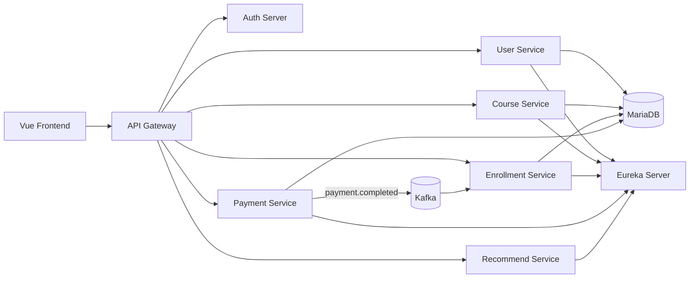

# KeyNexus

> 기업의 Credential과 디지털 구독 자산을 프로젝트 단위로 통합 관리하는 MSA 기반 거버넌스 플랫폼

KeyNexus는 사내에 흩어진 API Key, DB 계정, SaaS 구독 정보 등을 프로젝트별로 관리합니다. 프로젝트 접근 신청부터 리더 승인, Secret 조회, 감사 이력, 위험도 분석까지 자산 사용의 전체 흐름을 한곳에서 제공합니다.

> 이 저장소는 교육 목적으로 개발된 실습 프로젝트이며 상용 환경에 바로 사용할 수 있는 완성 제품이 아닙니다. 배포 목적에 맞는 보안·운영 보완이 필요합니다. 문의: audit@korea.ac.kr, Sungryel Lim Ph.D

## 목차

- [주요 기능](#주요-기능)
- [사용자 역할](#사용자-역할)
- [시스템 구성](#시스템-구성)
- [기술 스택](#기술-스택)
- [팀원](#팀원)
- [프로젝트 구조](#프로젝트-구조)
- [로컬 실행](#로컬-실행)
- [서비스 포트](#서비스-포트)
- [관련 문서](#관련-문서)

## 주요 기능

- 프로젝트 및 디지털 자산 카탈로그 생성·조회·검색
- API Key, DB Credential, SaaS 구독 플랜의 유형별 관리
- `ADMIN`·`LEADER`·`MEMBER` 역할 기반 접근 제어
- 프로젝트 접근 신청, 리더 승인·거절, 멤버 접근 권한 회수
- Kafka 이벤트를 통한 승인 결과 및 멤버십 상태 비동기 반영
- AES-GCM 기반 Credential Secret 암호화 저장과 승인 사용자 대상 조회
- Secret 조회·승인·거절·회전·폐기 행위의 감사 로그 기록
- 만료일, 회전 주기, 활성 사용자 수, 접근 거절 이력을 반영한 위험 점수 산출
- 프로젝트별 위험 등급과 만료·회전 권고 대시보드 제공

## 사용자 역할

| 역할 | 권한 |
| --- | --- |
| `ADMIN` | 모든 프로젝트와 자산을 조회·관리하는 전사 관리자 |
| `LEADER` | 담당 프로젝트와 자산을 관리하고 멤버의 접근 요청을 승인·거절·회수하는 프로젝트 리더 |
| `MEMBER` | 프로젝트 접근을 신청하고 승인된 프로젝트의 자산을 이용하는 팀원 |

## 시스템 구성



프로젝트 접근 승인 시 `payment-service`가 Kafka 이벤트를 발행하고 `enrollment-service`가 멤버십을 활성화합니다. `recommend-service`는 각 서비스의 데이터를 조합해 Credential 위험도와 조치 권고를 계산합니다.

## 기술 스택

| 구분 | 기술 |
| --- | --- |
| Frontend | Vue 3, Vue Router, Pinia, Axios, Vite 8 |
| Backend | Java 21, Spring Boot 3.4.5, Spring Cloud 2024.0.0, Spring Data JPA |
| Risk Engine | Python, FastAPI, Pydantic, Uvicorn |
| Security | Spring Security, OAuth 2.0, JWT, AES-GCM |
| Service Discovery | Netflix Eureka |
| Messaging | Apache Kafka |
| Database | MariaDB 11.2 |
| API Docs | springdoc-openapi, Swagger UI |
| Infra | Docker, Docker Compose, Nginx |
| Test | JUnit 5, Spring Boot Test, H2, Python unittest |

## 팀원

저장소의 커밋 이력에 기록된 식별자와 주요 기여 영역을 기준으로 정리했습니다.

| 팀원 | 주요 기여 영역 |
| --- | --- |
| Yoonseo Lee (`Hidy`) | 프로젝트 접근 권한 회수, 서비스 연동, 문서화 |
| 목진훈 (`komlab`) | 프로젝트·자산 및 접근 신청 API, 인증 호환, 통합·데모 환경 |
| `hxxnjoon` | Vue 프론트엔드 화면·라우팅, 인증 UI, 로컬 실행 환경 |
| `hwiho` | 위험도 분석, Credential 감사 이력, 서비스 간 인증·승인 연동 |

## 프로젝트 구조

```text
skala-msa/
├── vue-frontend/          # Vue 기반 사용자 화면
├── eureka-server/         # 서비스 디스커버리
├── user-service/          # 사용자 계정 및 역할 관리
├── course-service/        # 프로젝트와 Credential 자산 관리
├── enrollment-service/    # 프로젝트 접근 신청 및 멤버십 관리
├── payment-service/       # 접근 승인·거절·회수 및 감사 이력
├── recommend-service/     # 규칙 기반 위험도 분석과 조치 권고
├── init-db/               # DB 스키마, 인증 호환 View, 데모 데이터
├── docker/                # JVM 서비스 공통 런타임 이미지
├── scripts/               # 서비스 이미지 빌드 스크립트
├── docs/                  # 요구사항, 기능, 로컬 설정 문서
├── docker-compose.yml     # 전체 서비스 구성
└── CONTRIBUTING.md        # 브랜치·커밋·PR 협업 규칙
```

## 로컬 실행

### 사전 요구사항

- Docker 및 Docker Compose
- JDK 21
- Node.js `20.19+` 또는 `22.12+`

### 1. 환경 변수 준비

```bash
cp .env.example .env
cp vue-frontend/.env.example vue-frontend/.env
```

데모 데이터의 Secret을 정상적으로 복호화하려면 루트 `.env.example`의 `CREDENTIAL_ENCRYPTION_KEY`를 그대로 사용해야 합니다. 운영 환경에서는 별도 키를 안전하게 생성하고 관리해야 합니다.

### 2. 백엔드 이미지 빌드 및 실행

```bash
./scripts/build-images.sh
docker compose up -d
```

서비스 상태와 로그는 다음 명령으로 확인할 수 있습니다.

```bash
docker compose ps
docker compose logs -f
```

### 3. 프론트엔드 실행

```bash
cd vue-frontend
npm install
npm run dev
```

브라우저에서 <http://localhost:3000>으로 접속합니다. 상세한 초기 데이터 설정과 트러블슈팅은 [로컬 실행 가이드](./docs/LOCAL_SETUP.md)를 참고하세요.

### 종료

```bash
docker compose down
```

## 서비스 포트

| 서비스 | 포트 | 설명 |
| --- | ---: | --- |
| Vue Frontend | `3000` | 사용자 웹 애플리케이션 |
| API Gateway | `8080` | 외부 API 진입점 |
| User Service | `8081` | 사용자 관리 |
| Course Service | `8082` | 프로젝트·자산 관리 |
| Enrollment Service | `8083` | 접근 신청·멤버십 관리 |
| Payment Service | `8084` | 승인·감사 관리 |
| Recommend Service | `8085` | 위험도 분석 |
| Eureka Server | `8761` | 서비스 등록 현황 |
| Auth Server | `9000` | OAuth 2.0 인증 서버 |
| MariaDB | `3379` | 호스트 DB 접속 포트 |
| Kafka | `9092` | 이벤트 브로커 |

## 관련 문서

- [로컬 실행 및 트러블슈팅](./docs/LOCAL_SETUP.md)
- [핵심 기능 상세](./docs/feature_list.md)
- [시스템 요구사항 정의서](./docs/requirements_specification.md)
- [Credential 거버넌스 계획](./docs/credential_governance_plan.md)
- [협업 가이드](./CONTRIBUTING.md)
- [라이선스](./LICENSE)
